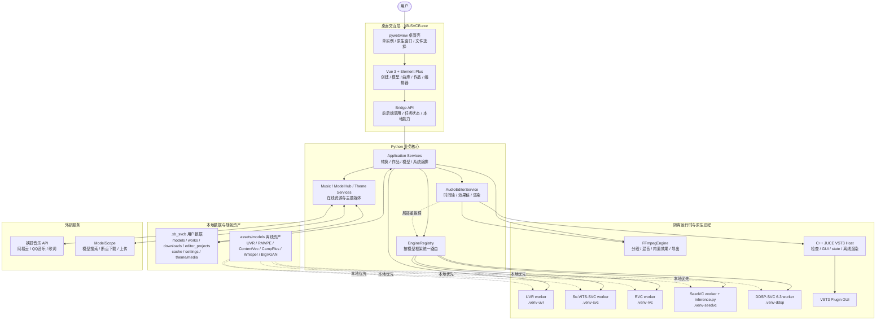
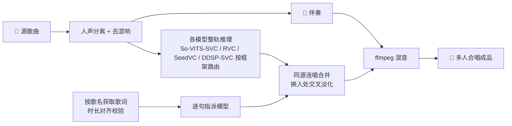
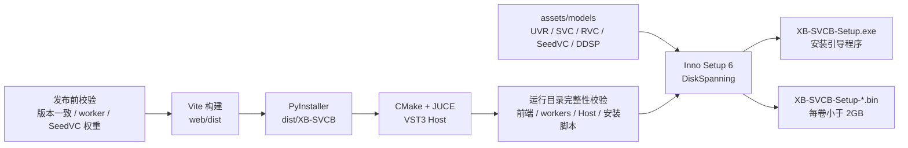

<div align="center">

# 🎤 XB-SVCB · AI 翻唱工具

#### 开箱即用的桌面级 AI 翻唱工作站

**🎵 导入歌曲 ｜ 🎚️ 人声分离 ｜ 🌫️ 去混响 ｜ 🗣️ AI 歌声转换 ｜ 🎼 合并伴奏 ｜ 🎤 成品翻唱**

一条龙完成整首歌的 AI 翻唱 · 支持 **So-VITS-SVC / RVC 多框架推理** · **多人混合翻唱** · **在线曲库** · **模型站** · **音频编辑器**

<br/>

[](LICENSE)
[](https://github.com/SDIJF1521/xb-svcb/releases/latest)
[](https://github.com/SDIJF1521/xb-svcb/releases)
[](https://github.com/SDIJF1521/xb-svcb/stargazers)

[](#)
[](#)
[](#)
[](#architecture)

<br/>

### ⬇️ [**点此下载安装器 · XB-SVCB-Setup.exe**](https://github.com/SDIJF1521/xb-svcb/releases/latest)

<sub>Windows 一键安装 · 内置前端与底模 · 无需手动配置 Python / Node</sub>

<sub>用户交流 / 反馈 QQ 群：**1038366109**</sub>

</div>

---
<a id="features"></a>

## ✨ 特性

- 🎚️ **全自动流水线** —— 一次点击走完「分离 → 去混响 → F0 → 推理 → 混音」。
- 🗣️ **真实 so-vits-svc 4.1 推理** —— 支持主模型 + 浅扩散，可调变调、F0 预测器、扩散步数。
- 🎛️ **多框架推理与统一管理（So-VITS-SVC / RVC / SeedVC / DDSP-SVC）** —— 推理引擎按模型「框架」可插拔：RVC 自动识别 `.index`，SeedVC 支持参考音频，DDSP-SVC 支持 Rectified Flow checkpoint、F0、采样步数与共振峰偏移；导入、模型管理、创建页和编辑器局部重推理按框架切换专属参数。
- 🧬 **多模型混合翻唱（可跨框架 · 合唱 · 可编辑时间轴）** —— 按歌名自动获取带时间轴歌词、或**导入本地 `.lrc`**，做时长对齐校验；提供**可编辑可视化时间轴**：拖动边界调整起止（自动吸附歌词时间）、缩放精修、拆分 / 合并 / 删除片段，**片段独立指派模型**；**一段可同时指派多个模型实现「合唱」**（多路人声等响度叠加 + 软限幅防破音）；**同一首歌可混用 So-VITS-SVC、RVC、SeedVC 与 DDSP-SVC 模型**；每个模型在完整人声上整轨推理，再「同源连唱合并、换人处交叉淡化」无缝拼成多人合唱。
- 🎛️ **Audio Editor Lite 音频编辑器** —— 从作品或本地音频创建编辑工程，支持工程选择页、多轨时间轴、真实波形、片段拖动/拉伸、精确播放头定位与剪切、切口交叉淡化、相邻片段渲染合并、片段声道分配（双声道 / L / R）、片段/音轨音频复制与剪贴板粘贴、音量包络、内置效果器、非模态 JUCE VST3 插件窗口、声卡回调块级实时插件处理、设备延迟状态、混音预览、时间轴拖动快进及 WAV / MP3 / FLAC 导出；支持 TXT / LRC 歌词导入与自动切句，可维护多角色并把片段分配给角色，内置独唱、对唱、主唱 + 和声、三角色剧情等时间轴模板。
- 🧠 **高级创作工作流** —— 歌声转换工作台支持「自动混音合成」「自动人声合并」「手动人声合并」「自动 + 编辑器二次调整」「全手动编辑」；其中人声合并只在多模型模式开放，避免单模型流程误用。
- 🎵 **在线资源获取（可播放校验）** —— 内置 **网易云 / QQ音乐** 曲库的搜索、试听、下载（QQ 可填会员 Cookie 取高品质音频），一次展示曲库接口返回的完整搜索列表；歌词读取对齐妖狐官方 `lrctxt` / `lrc` / `music.lrcurl` 响应，并为 QQ 免费曲库接入聚合歌词回退；**下载前校验资源可播放性**（魔数 / Content-Type / ffprobe），VIP / 无版权 / 失效链接不可下载，避免坑到后续推理；下载素材可一键进入翻唱。
- 🌐 **模型站（魔搭社区 · 后台传输）** —— 基于 **ModelScope** 一键**上传/下载**声音模型：填自己的访问令牌即可发布到自有公开仓库，按关键词**模糊搜索**（**分页加载**）社区模型并直接导入；带**架构标签**（So-VITS-SVC / RVC / SeedVC / DDSP-SVC）与**清单防污染**校验；上传/下载**挂后台执行、不阻塞操作**，大模型支持断点续传和重试，下载完成后立即进入可选模型列表。
- 🎼 **专业人声分离** —— `5_HP-Karaoke-UVR` 分离 + `UVR-DeEcho-DeReverb` 去混响，得到干净干声。
- ⚡ **GPU / CPU 自由切换** —— 自动识别 NVIDIA CUDA 与 AMD Radeon DirectML（含 **50 系/Blackwell 自动走 cu128 + torch 2.7**），长音频自动分段避免显存溢出。
- 🎨 **主题系统与自定义主题** —— 暗色 / 亮色 / 自定义主题一键切换并记忆，切换时从主题按钮触发基于原生页面快照的圆形扩散动画；自定义主题支持调色、背景图片 / MP4 动态壁纸和动态粒子，默认提供亮色「晴空花园」示例，连 pywebview **原生窗口标题栏/边框**也会在动画结束后自然同步。
- 👤 **个性化** —— 自定义头像与昵称、内置全局消息通知中心；切换页面后仍持续同步任务进度与失败原因，已读状态可在多个前端窗口间同步。
- 📦 **开箱即用** —— 安装后通过 `XB-SVCB.exe` 启动完整桌面应用（自带应用图标与前端资源），打开界面无需另装 Python / Node。
- 🧩 **环境隔离** —— 重型 AI 任务跑在独立子环境（`.venv-svc` / `.venv-rvc` / `.venv-seedvc` / `.venv-ddsp` / `.venv-uvr`），互不污染。
- 🎧 **作品库** —— 试听 / 导出成品，单独试听伴奏与干声，失败任务一键查日志；删除作品同步真实清理本地生成文件。

> **最新版本 v0.0.22**：新增 Windows AMD Radeon DirectML 支持，UVR、So-VITS-SVC、RVC 与 SeedVC 可使用 AMD GPU；DDSP-SVC 实机发现完整 DirectML 图会静默产生小声/静音/电流杂音，因此 AMD 机器暂用 CPU 稳定推理。设备 UI 根据各隔离环境实际能力显示 CUDA、ROCm、DirectML 或 CPU；启动设备探测已隐藏命令行窗口，并通过五环境并行探测和环境签名缓存缩短重复启动时间。详见 [v0.0.22 更新说明](release_notes_v022.md)。

> v0.0.21：音频编辑器的 VST3 插件 UI 改为非模态置顶窗口，可与主界面播放和时间轴操作并行；同一 GUI 插件实例通过 JUCE 声卡回调处理可听音频，参数在下一音频块生效，并显示设备实际块大小与延迟；新增相邻音频片段渲染合并。详见 [v0.0.21 更新说明](release_notes_v021.md)。
>
> v0.0.20：新增 DDSP-SVC 6.3 完整推理链路、共振峰偏移和独立安装环境；消息中心改为跨页面全局同步；UVR 严格遵循 GPU / CPU 选择；编辑器支持 TXT / LRC 歌词导入、静音辅助自动切句、多角色管理和时间轴模板；暗色主题切换改用 WebView2 原生页面快照与平滑减速动画。详见 [v0.0.20 更新说明](release_notes_v020.md)。
>
> v0.0.19：音频编辑器支持播放中自动更新效果，新预览在后台渲染完成后保持当前时间点热切换；时间轴播放头改用标尺真实零点换算，修复选择线固定偏离鼠标并兼容横向滚动；在线歌词按妖狐官方响应读取 `data.lrctxt`、`data.lrc` 和 `data.music.lrcurl`，QQ 免费详情会通过歌曲 `mid` 回退到聚合歌词接口。详见 [v0.0.19 更新说明](release_notes_v019.md)。
>
> v0.0.18：新增 **SeedVC 完整推理链路**，支持导入 checkpoint + YAML 配置、选择目标音色参考音频、创建任务、模型站下载断点续传与跨框架混唱；下载完成后模型库和创建页会立即刷新；自定义主题背景升级为本地持久化的图片 / MP4 动态壁纸，修复浏览器开发模式预览丢失；在线曲库适配妖狐 API `V2.1.3.8`，移除已废弃的 `g` 参数并兼容会员音频与 URL 型歌词；安装器升级为显式分卷发布，构建时校验版本、前端、全部 worker、SeedVC 和 JUCE Host，安装后复核关键运行环境。详见 [v0.0.18 更新说明](release_notes_v018.md)。
>
> v0.0.17：聚焦 **音频编辑器效果器与插件 Host**——编辑器新增片段/音轨音频复制到系统剪贴板、从剪贴板把音频粘贴回音轨、音量包络，以及混响、降噪、噪声门、压缩、EQ、高通/低通、延迟、合唱、限幅、增益等内置效果器；外部插件效果器改为 `Python -> C++ JUCE VST3 Host -> VST3 Plugin GUI` 架构，前端插件窗口已拆成独立组件，支持 VST3 插件检查、原生 GUI 打开和插件 state 回写；局部重推理会清理旧缓存并剥离插件效果，避免效果器污染模型生成的干声音频；发布构建会强制校验并携带 `xb-juce-vst3-host.exe`，避免生成装完后插件系统不可用的安装包。
>
> v0.0.16：聚焦 **主题体验、音频编辑组织能力与安装稳定性**——前端主题切换改为接近 Element Plus 官网的圆形扩散过渡，并抽成 `ThemeSwitcher` / `CustomThemeEditor` / `ThemePresetList` / `ThemeBackground` 等组件；自定义主题支持亮色默认示例、色彩编辑、背景图片和动态粒子；音频编辑器新增多角色管理与时间轴模板，可为片段标注角色并快速生成独唱、对唱、和声、剧情分轨；安装器与应用版本同步到 `0.0.16`，UVR/RVC/SVC 环境搭建会保护 GPU torch 栈，避免有 NVIDIA GPU 的用户在部署 UVR 环境时被替换成 CPU 版 PyTorch。
>
> v0.0.15：聚焦 **数据目录迁移与 RVC 安装稳定性**——默认用户数据目录升级为 `.sb-svcb`，兼容旧目录并同时写入安装目录与用户 AppData 指针；首页将「选择目录」与「迁移数据」拆开，迁移过程显示复制进度，完成后当前会话立即重定向模型、作品、设置与编辑工程仓储；RVC 环境安装时会从自带底模预置 hubert/rmvpe 并修复 RMVPE checkpoint，缺失时走 HuggingFace 镜像，40 系及以下 NVIDIA 统一 cu121，50 系继续 cu128；安装脚本自动配置 HF/PyPI 镜像，降低首次安装和修复环境的网络失败率。
>
> v0.0.14：聚焦 **音频编辑工作台与安装器完整化**——编辑器支持添加/删除音轨、导入音频时选择目标音轨、可选人声分离、按歌词切分人声音频（支持 API 获取歌词或导入 `.lrc` 文件）；局部重新推理可微调模型与推理参数，时间轴为不同模型/框架分配更容易区分的颜色；安装器同步升级为单一 EXE 窗口流程，会先检查运行环境再选择安装路径，可自动检测/安装 Python、Git、ffmpeg、uv、CUDA 与 C++ Build Tools，CUDA 与 torch 栈会复核实际显卡，CPU 或不兼容显卡会跳过 CUDA 并安装 CPU 版 torch，前置依赖与运行环境搭建阶段会显示进度条，不再弹出 PowerShell/命令行窗口，日志写入安装目录，并可选择在安装器窗口内显示详细安装信息。
>
> v0.0.13：新增 **用户数据目录选择与迁移**——安装时可把 `.sb-svcb` 数据目录放到空间充足的磁盘，软件首页也可查看占用/剩余空间并一键迁移模型、作品、下载素材、编辑工程与缓存；手动人声合并改为真正的**逐段编辑工程**，每个参与 AI 独立成轨，轨内只包含该 AI 负责的分段音频；试听与导出统一走带交叉淡化的时间轴渲染，片段声道选择（双声道 / L / R）在编辑判断时即可听到真实效果。
>
> v0.0.12：聚焦 **稳定性与创作效率**——增强音频编辑器工程管理、工作流预设与复用、模型管理与传输体验、任务通知与日志入口；优化长音频处理、混音预览、时间轴操作和安装器环境修复流程；修复编辑器状态不同步、长音频导出偶发失败、模型站传输状态刷新不及时、以及主题/缩放后部分界面布局异常等问题。
>
> v0.0.11：新增 **Audio Editor Lite 音频编辑工作台**——可从作品或本地音频创建编辑工程，支持工程选择页、多轨时间轴、真实波形、片段拖动/拉伸、播放头剪切、切口交叉淡化、片段声道分配（双声道 / L / R）、局部重推理替换片段、混音播放时拖动时间轴快进；歌声转换新增高级工作流（自动混音、人声合并、自动 + 编辑器二次调整、全手动编辑），并限制人声合并仅在多模型模式开放；局部重推理新增 **1 秒最短片段保护**，顶栏导航收纳为主入口 +「资料库」，页面更清爽。
>
> v0.0.10：新增 **RTX 50 系显卡（Blackwell, sm_120）适配**——安装器自动识别 50 系并切换到 **cu128 + PyTorch 2.7** 专用栈（SVC / RVC 改用 Python 3.10，torchaudio 音频 I/O 走 soundfile，fairseq 重装并打 `weights_only` 补丁），彻底解决「仅升级 CUDA/torch 会哑音、效果不如 40 系/CPU」的问题，可用 `--cu128` / `--no-cu128` 手动切换，40 系及以下统一使用 cu121 栈；修复 **模型站只能搜到自己上传的模型**——改为按仓库名前缀 `xb-svcb` 全站搜索，即可发现所有人公开分享的模型（前缀 + 清单校验仍把关防污染）；时间轴 UI 稳健性增强（迷你时间轴总宽度固定、色块百分比钳制在轴内，长歌词不再撑破布局）。
>
> v0.0.9：混合翻唱升级 **可编辑可视化时间轴**——色块可**拖动左右边界**调整起止并**自动吸附歌词时间**、**缩放**放大局部精修、**拆分 / 合并 / 删除**片段，**片段与歌词解耦**、每段独立指派模型；**合唱多模型 UI 重构**（胶囊超 3 个折叠为「+N」、色块只显数量角标、弹窗与列表可滚动），多模型不再撑破布局；在线资源**下载前校验可播放性**（魔数 / Content-Type / ffprobe 探测，不可播放的不允许下载），歌词获取**新增导入本地 `.lrc` 时间轴歌词文件**。
>
> v0.0.8：混合翻唱新增 **「合唱」**——一句歌词可同时指派多个模型，多路人声按等响度叠加并经软限幅防破音；模型站**上传/下载挂后台执行**，不再阻塞前端操作，顶栏新增「传输」面板统一查看进度；**模型搜索与在线资源获取均支持分页「加载更多」**，减少单次查询等待。
>
> v0.0.7：新增 **RVC 推理**（基于 `rvc-python`）与**多框架推理抽象**——推理引擎按模型「框架」可插拔，导入/创建页按框架切换专属参数（protect / filter_radius / 版本 v1·v2），**混合翻唱可在同一首歌混用 RVC 与 so-vits-svc 模型**；RVC 跑在独立子环境 `.venv-rvc`，自动识别 `.index` 检索特征。
>
> v0.0.6：新增 **模型站（ModelScope 魔搭社区）**——用自己的访问令牌把本地模型一键发布到自有公开仓库，并按关键词**模糊搜索**、直接下载导入社区模型；模型带**架构标签**（So-VITS-SVC / RVC…）、**清单防污染**校验，上传/下载全程**进度条**实时反馈。
>
> v0.0.5：重做 **多模型混合翻唱** 合成——每个模型在完整人声上**整轨推理**，再「同一歌手连唱合并、仅在换人处交叉淡化」拼接，彻底消除逐句碎片推理带来的电流声 / 咔哒声 / 卡顿。
>
> v0.0.4：资源获取新增 **QQ音乐** 曲库（支持会员 Cookie 获取高品质音频）；新增 **多模型混合翻唱**（按歌词逐句指派不同模型）；删除作品时同步真实清理本地生成文件。
---
<a id="architecture"></a>

## 🏗️ 架构一览

XB-SVCB 采用“**桌面应用负责交互与编排，重型引擎在独立进程运行**”的结构。安装版以 `XB-SVCB.exe` 为统一入口，PyInstaller 运行目录内同时携带 Vue 前端、Python 业务代码与 worker 脚本；So-VITS-SVC、RVC、SeedVC、UVR 和 VST3 插件则通过各自的隔离环境或原生 Host 执行，避免依赖与插件崩溃相互污染。



**关键边界**

- **桌面进程只负责编排**：Vue 通过 pywebview Bridge 调用 Python 服务；耗时推理交给 worker 子进程，主界面可以持续显示任务与传输进度。
- **模型按框架路由**：`EngineRegistry` 统一接收模型与推理参数，再分别调用 So-VITS-SVC、RVC、SeedVC 或 DDSP-SVC；SeedVC 额外传入参考音频，DDSP-SVC 使用 Rectified Flow checkpoint 与 YAML 配置。
- **编辑器与插件隔离**：内置效果、混音和导出走 FFmpeg；VST3 加载与原生窗口由 JUCE Host 承载，局部重推理再回到统一引擎路由。
- **数据与程序分离**：模型、作品、下载素材、编辑工程、缓存、设置及 `theme/media` 都写入可迁移的 `.xb_svcb`，覆盖升级不会替换用户数据。
- **离线资产优先**：安装包预置关键底模；worker 优先解析本地文件，仅在缺失时使用镜像或上游服务。

| 层 / 进程    | 主要实现                                         | 职责与边界                                                     |
| ------------ | ------------------------------------------------ | -------------------------------------------------------------- |
| 桌面交互层   | pywebview + Vue 3 + Element Plus                 | 单实例窗口、页面交互、文件选择、任务状态和主题展示             |
| API 与业务层 | `api` + `application` + `domain`           | 转换流程、模型/作品/曲库/编辑工程服务及业务状态编排            |
| 基础设施层   | `infrastructure` + `EngineRegistry` + FFmpeg | 路径、仓储、下载、音频处理和多框架引擎适配                     |
| AI 子进程    | SVC / RVC / SeedVC / DDSP-SVC / UVR workers      | 在独立`.venv-*` 环境中执行重型推理，隔离 Python 与 CUDA 依赖 |
| 原生插件进程 | C++ / JUCE VST3 Host                             | 插件检查、原生 GUI、参数 state 回写与离线渲染                  |
| 持久化层     | `.xb_svcb` + `assets/models`                 | 用户数据可迁移保存；发布资产本地优先供各 worker 使用           |
| 在线集成     | 妖狐音乐 API + ModelScope                        | 曲库/歌词获取、候选地址校验、模型搜索、上传和断点下载          |

---

<a id="quickstart"></a>

## 🚀 快速开始（最终用户）

> 推荐直接用图形安装器，无需任何命令行操作。

1. 在 [Releases](https://github.com/SDIJF1521/xb-svcb/releases/latest) 下载 **`XB-SVCB-Setup.exe`** 和同版本的全部 **`XB-SVCB-Setup-*.bin`**，放在同一目录后双击 EXE。
2. 在「选择安装位置」页**自定义安装路径**（默认 `%LOCALAPPDATA%\Programs\XB-SVCB`，无需管理员权限）。应用 exe 与全部依赖（`engines/`、`.venv-svc`、`.venv-rvc`、`.venv-seedvc`、`.venv-ddsp`、`.venv-uvr`、`models/`）都装进**这个目录**。
3. 在「选择用户数据存储位置」页选择 `.xb_svcb` 数据目录（默认 `{安装目录}\.xb_svcb`）。模型、作品、下载素材、编辑工程与缓存都会保存在这里，C 盘空间不足时建议选 D/E 盘。
4. 勾选「安装后立即搭建运行环境」，联网创建 AI 子环境（由 `setup_env.bat` 调 `install.py`，无 PowerShell）。
5. 通过桌面 / 开始菜单的 **XB-SVCB** 快捷方式启动。后续可在首页「数据存储位置」查看占用/剩余空间，并迁移到其它磁盘。

> 💡 **应用界面本身无需任何依赖即可打开**；只有「搭建运行环境」这一步需要 **Python 3.10+** 与 **ffmpeg**（Git 可选，缺失会自动改用下载 ZIP）。安装器会检测并提示缺失项；若某步失败，可从开始菜单「搭建/修复运行环境」重试。

### 💾 数据存储与迁移

- 默认用户数据目录为 `.xb_svcb`，用于保存模型库、作品、在线下载素材、音频编辑工程、波形/渲染缓存、配置文件和 `theme/media` 自定义背景媒体。
- 安装时可在「选择用户数据存储位置」页把 `.xb_svcb` 放到空间充足的磁盘，避免占满 C 盘。
- 软件首页提供「数据存储位置」卡片，可查看当前目录、已用空间和所在磁盘可用空间。
- 点击「选择并迁移」会把现有数据复制到新目录；迁移前会检查目标目录可写、目标磁盘剩余空间是否足够、是否存在正在运行/排队的推理任务。
- 迁移完成后需要重启软件；重启后所有后续生成文件都会写入新目录，旧目录会在确认迁移标记后自动清理。
- 旧版本目录 `.sb-svcb` / `.xb_xvcb` / `.sv-xvcb` / `.xb-svcb` 仍会被兼容识别，升级时不会丢失已有数据。

### 📋 环境要求

| 软件                            | 用途                      | 说明                                                                                                                                                 |
| ------------------------------- | ------------------------- | ---------------------------------------------------------------------------------------------------------------------------------------------------- |
| **Python 3.10.5+**        | 运行安装器与主程序        | 安装时勾选*Add to PATH*                                                                                                                            |
| **uv**                    | 虚拟环境管理工具          | 安装器使用 uv 管理虚拟环境（缺失会自动安装）                                                                                                         |
| **ffmpeg**                | 音频转码 / 混音           | 需在 PATH 中可用                                                                                                                                     |
| **Git**（可选）           | 获取 so-vits-svc 仓库     | 没有也行，安装器会自动下载 ZIP                                                                                                                       |
| **GPU 运行时**（可选）    | GPU 加速                  | NVIDIA 自动安装 cu121/cu128 PyTorch；Windows AMD Radeon 自动安装 `torch-directml`；无兼容 GPU 时使用 CPU torch |
| **Node.js LTS**（含 npm） | 构建前端                  | 仅「从源码安装」需要                                                                                                                                 |
| **C++ 生成工具**（可选）  | 编译依赖 / JUCE 插件 Host | 部分 Python 包需要 C++14 编译器；构建音频编辑器 VST3 插件 Host 需要 C++17 + CMake + JUCE；安装时勾选**Desktop development with C++**           |

#### 🔗 安装链接

| 软件                               | 下载链接                                                                                                                                                                                                            |
| ---------------------------------- | ------------------------------------------------------------------------------------------------------------------------------------------------------------------------------------------------------------------- |
| **Python 3.10.5**            | [https://www.python.org/downloads/release/python-3105/](https://www.python.org/downloads/release/python-3105/)                                                                                                       |
| **uv**                       | [https://github.com/astral-sh/uv/releases](https://github.com/astral-sh/uv/releases)                                                                                                                                 |
| **Git**                      | [https://git-scm.com/downloads](https://git-scm.com/downloads)                                                                                                                                                       |
| **CUDA Toolkit 12.1 / 12.8** | [https://developer.nvidia.com/cuda-toolkit-archive](https://developer.nvidia.com/cuda-toolkit-archive)                                                                                                               |
| **ffmpeg**                   | [https://github.com/BtbN/FFmpeg-Builds/releases/download/latest/ffmpeg-master-latest-win64-gpl-shared.zip](https://github.com/BtbN/FFmpeg-Builds/releases/download/latest/ffmpeg-master-latest-win64-gpl-shared.zip) |
| **Node.js LTS**              | [https://nodejs.org/](https://nodejs.org/)                                                                                                                                                                           |
| **C++ Build Tools**          | [https://visualstudio.microsoft.com/zh-hans/visual-cpp-build-tools/](https://visualstudio.microsoft.com/zh-hans/visual-cpp-build-tools/)                                                                             |
| **CMake**                    | [https://cmake.org/download/](https://cmake.org/download/)                                                                                                                                                           |
| **JUCE**                     | [https://github.com/juce-framework/JUCE](https://github.com/juce-framework/JUCE)                                                                                                                                     |

> 💡 **关于 CUDA**：安装器会先复核实际显卡，40 系及以下兼容 NVIDIA 使用 **cu121**，50 系 Blackwell 使用 **cu128**；CPU 或不兼容显卡会跳过 CUDA 并安装 CPU 版 torch。PyTorch wheel 已内置对应 CUDA 运行库，通常只需匹配的新 NVIDIA 驱动，完整 CUDA Toolkit 仅用于本地编译/工具链。

> 图形安装器会同时使用 `nvidia-smi` 与 `Win32_VideoController` 检测 NVIDIA：RTX 4060 应显示为 **cu121**，CUDA Toolkit 默认目录为 `C:\Program Files\NVIDIA GPU Computing Toolkit\CUDA\v12.1`；RTX 50 系显示为 **cu128**，默认目录为 `...\CUDA\v12.8`。CPU / AMD DirectML 会明确跳过 CUDA，不会在后续安装阶段重新改成 CUDA。

> 🔴 **关于 AMD**：Windows 下检测到 AMD Radeon 时，UVR、So-VITS-SVC、RVC 与 SeedVC 安装 **DirectML + torch 2.4.1**；DDSP-SVC 暂时使用 CPU Torch，因为实机确认其完整 DirectML 图可能无异常返回却产生小声、静音或电流杂音。RVC/SeedVC 的 RMVPE 使用 CPU 稳定路径，其他受支持的神经网络仍由 AMD GPU 加速。
>
> 🟢 **50 系显卡（RTX 5060/5070/5080/5090，Blackwell, sm_120）**：cu121 无 sm_120 内核，仅升级 torch 还会出哑音，因此安装器**检测到 50 系会自动切换到 cu128 + torch 2.7 的专用栈**（SVC / RVC 改用 Python 3.10，torchaudio I/O 走 soundfile，fairseq 重装并打 `weights_only` 补丁）。需安装 **CUDA 12.8 级别的新版 NVIDIA 驱动**；若检测不到兼容 NVIDIA 显卡，会自动回退 CPU 版 torch，避免装错 CUDA 栈。

- 安装建议：**建议直接用图形安装器**，无需任何命令行操作，选择仅此用户安装（用途一个盾标志的选项）。

#### 🧯 软件安装失败，解决方法

如果图形安装器搭建运行环境失败，可按下面步骤手动补齐依赖后重跑环境安装：

1. 安装 [Python 3.10.5](https://www.python.org/downloads/release/python-3105/)，安装时勾选 **Add Python to PATH**。
2. 打开终端，输入：

```bat
pip install uv
```

3. 按显卡型号安装 CUDA：RTX 50 系显卡安装 [CUDA Toolkit 12.8](https://developer.nvidia.com/cuda-toolkit-archive)，RTX 40 系及以下安装 [CUDA Toolkit 12.1](https://developer.nvidia.com/cuda-toolkit-archive)；CPU 用户可跳过 CUDA。
4. 安装 [ffmpeg](https://github.com/BtbN/FFmpeg-Builds/releases/download/latest/ffmpeg-master-latest-win64-gpl-shared.zip)，将压缩包解压，打开解压后文件夹里的 `bin` 目录，复制该路径并粘贴到系统环境变量 `Path` 中。
5. 安装 [C++ Build Tools](https://visualstudio.microsoft.com/zh-hans/visual-cpp-build-tools/)，使用这个安装器安装 C++ 环境，建议勾选 **Desktop development with C++**。
6. 打开 XB-SVCB 软件安装路径文件夹，按住 `Shift` 右键，选择「在此处打开终端」，然后按显卡类型运行：

```bat
rem 50 系显卡（cu128）
python install\install.py --root "D:\XB-SVCB" --skip-app --skip-web --cu128 --only uvr svc rvc seedvc ddsp hub models

rem 40 系及以下 NVIDIA 显卡（cu121）
python install\install.py --root "D:\XB-SVCB" --skip-app --skip-web --no-cu128 --only uvr svc rvc seedvc ddsp hub models
```

> 如果安装路径不是 `D:\XB-SVCB`，请把命令里的 `D:\XB-SVCB` 改成实际安装目录。等待命令运行完毕后，软件运行环境即安装完成。

---

<a id="from-source"></a>

## 🛠️ 从源码搭建（开发者 / 高级用户）

环境搭建由 `install/install.py` 负责，入口是纯批处理 `setup_env.bat`（内部直接调 Python，**全程不涉及 PowerShell**）。在项目根目录运行：

```bat
setup_env.bat
```

将自动完成（全部落在项目目录内，便于卸载）：

| 步骤           | 产物                                                                      | 说明                                                                                                                                          |
| -------------- | ------------------------------------------------------------------------- | --------------------------------------------------------------------------------------------------------------------------------------------- |
| 1 (`app`)    | `app/.venv`                                                             | 主程序环境（pywebview）                                                                                                                       |
| 2 (`web`)    | `web/dist`                                                              | 前端构建产物                                                                                                                                  |
| 3 (`uvr`)    | `.venv-uvr`                                                             | 人声分离环境（audio-separator）                                                                                                               |
| 4 (`svc`)    | `engines/so-vits-svc` + `.venv-svc`                                   | so-vits-svc 4.1 仓库与推理环境（Python 3.9 / cu121；**50 系：Python 3.10 / cu128 + torch 2.7**）                                        |
| 5 (`rvc`)    | `.venv-rvc`                                                             | RVC 推理环境（`rvc-python`，Python 3.9 / cu121；**50 系：Python 3.10 / cu128 + torch 2.7**；安装时预置 hubert/rmvpe，缺失才镜像下载） |
| 6 (`seedvc`) | `engines/seed-vc` + `.venv-seedvc`                                    | SeedVC 推理环境（官方 Seed-VC；模型导入 checkpoint + config，推理时选择目标音色参考音频）                                                     |
| 7 (`ddsp`)   | `engines/ddsp-svc` + `.venv-ddsp`                                     | DDSP-SVC 6.3、ContentVec、RMVPE 与 PC-NSF-HiFiGAN 推理环境                                                                                    |
| 8 (`hub`)    | `.venv-hub`                                                             | 模型站上传组件（`modelscope` SDK；仅上传需要）                                                                                              |
| 9 (`models`) | `models/`、`engines/so-vits-svc/pretrain/`、`assets/models/seedvc/` | UVR、SVC/RVC、SeedVC 与 DDSP-SVC 离线资产                                                                                                     |

更细的控制可直接调用 `install.py`：

```bat
python install\install.py --cpu          rem CPU 版
python install\install.py --gpu          rem 自动选择 NVIDIA CUDA 或 AMD DirectML
python install\install.py --directml     rem 强制安装 AMD/Windows DirectML 版
python install\install.py --only svc     rem 只重跑某一步：app / web / uvr / svc / rvc / seedvc / ddsp / hub / models
python install\install.py --only rvc     rem 只搭建 RVC 推理环境 .venv-rvc（rvc-python）
python install\install.py --only seedvc  rem 只搭建 SeedVC 推理环境 .venv-seedvc
python install\install.py --only ddsp    rem 只搭建 DDSP-SVC 6.3 推理环境 .venv-ddsp
python install\install.py --skip-svc     rem 跳过 so-vits-svc（仅装壳 + 分离 + 前端）
```

音频编辑器的 VST3 插件系统需要额外构建 JUCE Host。安装 CMake、C++ Build Tools 和 JUCE 后：

```powershell
$env:XB_JUCE_DIR="C:\path\to\JUCE"
.\native\juce-vst3-host\build.ps1
```

构建产物会写到 `engines/juce-vst3-host/xb-juce-vst3-host.exe`，这也是源码运行时默认寻找的位置。

> 每一步都是**幂等**的：失败后重跑只补齐缺失部分。首次安装需下载较多依赖与模型（合计数 GB），请保持网络通畅。

**国内加速 / 离线镜像**：安装器会自动为当前安装流程配置 `XB_HF_MIRROR` / `HF_ENDPOINT`（默认 `https://hf-mirror.com`）和 `XB_PYPI_MIRROR` / `PIP_INDEX_URL` / `UV_DEFAULT_INDEX`（默认清华 PyPI 镜像），底模与普通 Python 依赖优先走国内镜像，官方 PyPI 仅作兜底；torch 的 CUDA/CPU wheel 仍走 PyTorch 专用源，避免装错版本。GitHub 资源带 ghproxy 回退。仍不通时可手动覆盖后重跑 `python install\install.py --only models`：

```bat
set XB_HF_MIRROR=https://hf-mirror.com
set HF_ENDPOINT=https://hf-mirror.com
set XB_PYPI_MIRROR=https://pypi.tuna.tsinghua.edu.cn/simple
set XB_GH_MIRROR=https://ghfast.top
```

### 启动

```bat
run.bat
```

或手动：`app\.venv\Scripts\python.exe app\main.py`

---

<a id="usage"></a>

## 🎬 使用流程

1. **模型管理** —— 按框架导入模型：So-VITS-SVC 使用主模型 + 配置（可选浅扩散），RVC 使用 `.pth` + 可选 `.index`，SeedVC 使用 checkpoint + YAML，DDSP-SVC 使用 Rectified Flow `.pt` + `config.yaml`；也可在「模型站」搜索并下载社区模型。
2. **资源获取（可选）** —— 在「资源获取」页填好妖狐 API Key（QQ 想要高音质再填会员 Cookie），切换曲库（网易云 / QQ音乐）搜索、试听并下载歌曲素材到本地。
3. **新建翻唱** —— 上传或从已下载素材选歌，选择翻唱模式：

- **单模型** —— 选一个角色模型，设置变调 / F0 预测器 / 推理设备（GPU·CPU）等，整首歌统一演唱。
- **多模型混合** —— 勾选多个模型并分别设参；按歌名获取歌词、校验时长对齐（可整体偏移），再逐句指派模型。

4. **选择高级工作流（可选）** —— 默认走「自动混音合成」；多模型模式可选「自动人声合并」或「手动人声合并」；需要后期微调时选「自动 + 编辑器二次调整」，只想从素材开始剪辑时选「全手动编辑」。
5. **自动处理** —— 单模型：分离 → 去混响 →（so-vits-svc 才需）F0 → 模型推理 → 混音；多模型：分离 → 歌词分割 → 整轨逐模型推理 → 人声合并（同源连唱合并 + 换人处交叉淡化）→ 混音。
6. **作品库 / 音频编辑器** —— 试听 / 导出成品，单独试听**伴奏**与**干声**；失败任务一键打开日志；删除作品会真实清理其本地生成文件。需要微调时可从作品创建编辑工程，在音频编辑器中剪切、淡化、调声道、重推理片段并导出。

---

<a id="audio-editor"></a>

## 🎛️ Audio Editor Lite 音频编辑器

Audio Editor Lite 是内置的轻量多轨编辑工作台，用来完成自动翻唱后的二次调整，或直接把本地音频当作素材手动剪辑。它不是传统 DAW 的完整替代，而是围绕 AI 翻唱后期最常见的修补、对齐、淡化和导出流程设计。

**核心能力**

- **工程选择页**：音频编辑入口会先进入工程列表，可打开已有工程、导入音频新建工程、删除工程；编辑器内「退出」返回工程选择页，「放弃工程」会删除当前编辑工程。
- **真实波形时间轴**：桌面环境下由后端读取真实音频，按片段 `offset` 与片段时长生成波形；波形长度会随时间轴缩放和片段长度对齐。纯浏览器 dev 环境使用等宽模拟波形。
- **多轨片段编辑**：支持片段拖动、边界拉伸、播放头剪切、切口交叉淡化、静音、锁定、音量、淡入淡出。
- **音频剪贴板**：可将选中片段或整条音轨渲染为 WAV 并复制到操作系统剪贴板；也可把软件内复制的音频，或资源管理器复制的 WAV / MP3 / FLAC / M4A 等音频粘贴到选中音轨，多个文件会从播放头开始顺序铺开。
- **声道与预览**：片段可指定双声道 / 左声道 / 右声道；片段试听与混音预览都会按当前工程重新渲染，方便直接判断切口、淡化和声道摆位。时间轴点击与拖动以标尺真实零点换算，横向滚动后播放头仍与鼠标对齐。
- **效果器与插件**：片段可叠加混响、降噪、噪声门、压缩、EQ、高通、低通、延迟、合唱、限幅、增益等内置效果器；外部 VST3 效果器走 `Python -> C++ JUCE VST3 Host -> VST3 Plugin GUI`，前端提供组件化「插件窗口」弹窗，JUCE Host 负责 VST3 检查/加载、离线渲染、原生 GUI、state 回写与播放同步监听。目标插件前的片段信号会按播放头送入 GUI 所属实例，驱动插件频谱/VU；可听输出仍在后台重渲染后保持当前位置热切换。
- **外部插件兼容范围**：当前只支持 **64 位 Windows VST3 音频效果器**（通常为 `.vst3`），插件可以位于用户选择的任意目录，不限制在系统默认 VST3 目录。暂不支持 VST2 `.dll`、32 位插件、CLAP、AAX、AU，也不把需要 MIDI 音符的 VST3i 乐器作为人声音频效果器处理；外部侧链、特殊多总线和依赖额外采样库的插件仍取决于插件自身实现与资源完整性。
- **音量包络**：片段可启用多点音量包络，渲染时按时间线插值，适合做局部压低、渐强和句尾修整。
- **手动人声合并工程**：多模型「手动人声合并」不会先自动拼成完整人声，而是生成逐段可编辑素材；每个参与 AI 独立成轨，轨内只包含该 AI 负责的分段音频，导出默认为人声文件。
- **局部重推理**：可选中片段并指定模型重新推理替换；重推理会使用原始片段裁剪作为模型输入，清理旧推理缓存，替换后移除插件类效果并记录到片段 metadata，避免 VST3 插件效果污染新的模型干声；短于 **1 秒** 的片段会被前后端同时拦截，避免过短音频导致模型推理不稳定。
- **导出格式**：编辑工程可导出 WAV / MP3 / FLAC。

---

<a id="multi-model"></a>

## 🧬 多模型混合翻唱流程

一首歌可以让**多个角色模型逐句轮唱**，合成一首「多人合唱 / 对唱」。整套流程分为**前台指派**与**后台合成**两段：



**前台：选模型 → 取歌词 → 对齐 → 指派**

1. **选模型并设参** —— 在「新建翻唱」切到「多模型混合」，勾选多个角色模型；每个模型可单独设变调 / F0 预测器 / 扩散步数 / 推理设备（GPU·CPU）。
2. **获取歌词** —— 输入歌名（可选曲库与单曲序号），自动拉取带时间轴的 LRC 歌词。网易响应依次尝试 `data.lrctxt`、`data.lrc`、`data.music.lrcurl` 与 `data.music.lrc`；QQ 免费详情不直接带歌词时，从 `data.html` 提取歌曲 `mid` 并调用妖狐聚合歌词接口。
3. **对齐校验** —— 比对歌词时间轴与音频实际时长；若有系统性偏差，用「整体偏移」滑杆整体平移到对齐。
4. **逐句指派（支持合唱）** —— 给每一句歌词选择由哪个模型演唱；**一句可同时选多个模型实现「合唱」**（界面会标注「合唱」）；未指派 / 标记为「间奏·不唱」的句子会保留原始（近静音）人声占位。

**后台：分离 → 整轨推理 → 合并 → 混音**

1. **人声分离 + 去混响** —— 与单模型一致，得到干净干声与伴奏。
2. **整轨逐模型推理** —— 每个参与模型都在**完整人声**上推理一次（而非逐句切片送推）。整轨上下文连续，避免短碎片产生的句首/句尾电流声与咔哒声。
3. **按时间轴合并（含合唱叠声）** —— 自动流程会把相邻、且指派给**同一组模型**的句子并成一个连续段，从对应整轨结果整块切出；**合唱句把多路人声按 `1/√N` 等响度叠加并经软限幅（`alimiter`）防破音**；仅在**真正换人处**用交叉淡化（`acrossfade`）无缝衔接，并多借少量素材补回交叉消耗，保证总时长与伴奏精确对齐、不漂移。
4. **手动人声合并** —— 该流程会跳过自动拼接，改为生成编辑器分段素材：一个 AI 一条轨，每个片段只包含该 AI 在对应时间段的声音；试听与导出时在拼接处应用交叉淡化。
5. **混音输出** —— 自动流程会把合并后的完整人声与原伴奏混音，得到多人合唱成品；手动人声合并则进入编辑器由用户调整后导出人声。

> 💡 间奏、前奏、尾奏等没有指派模型的区间会自动以原始人声（分离后近静音）填充，确保整条时间轴连续、不会错位。

---

<a id="model-hub"></a>

## 🌐 模型站（ModelScope 魔搭社区）

在「声音模型 → 模型站」标签页，可以把训练好的模型分享到社区，也能搜索并下载别人分享的模型，**全程在软件内完成、带进度条**。

**方案要点（每人自有令牌 + 标记防污染）**

- **自有令牌**：在「ModelScope 设置」填入你自己的访问令牌（[个人中心 → 访问令牌](https://www.modelscope.cn/my/myaccesstoken)），仅保存在本地。上传只会发布到**你自己的命名空间**。
- **防污染**：上传的仓库统一带 `xb-svcb-` 前缀，并写入带签名标记的清单文件 `xb-svcb-model.json`（含 `magic` / 架构 / 各文件角色）。搜索/下载时只保留「带前缀且清单校验通过」的条目，避免被无关模型干扰。
- **架构标签**：上传时标注模型框架（**So-VITS-SVC** / RVC / SeedVC 等），便于他人按类型筛选；搜索结果可按架构过滤，为后续多框架兼容预留。

**搜索 / 下载**

1. 填好令牌后，在搜索框输入关键词（支持中文、多词**模糊匹配**，留空浏览全部），可叠加架构筛选。
2. 命中结果会先列出**你自己命名空间**内的模型（上传后必定可见），再合并全站按标记搜索到的社区模型。
3. 点「下载导入」即流式下载（按字节显示**进度条**），完成后自动导入到「本地模型」。

**上传分享**

1. 在「本地模型」列表对某个模型点「分享到模型站」，确认/选择其框架架构。
2. 软件打包模型文件 + 生成清单后，经独立上传组件逐个文件上传（按文件显示**进度条**）。
3. 完成后即在你的 ModelScope 公开仓库可见，社区可搜索下载。

> 💡 上传需要独立的上传组件环境 `.venv-hub`（含 `modelscope` SDK），由安装器的「模型上传组件」步骤创建；**搜索 / 下载仅用内置 httpx，无需该组件**。

---

## 📁 目录结构

```
翻唱工具/
├─ app/                         # 主程序（pywebview + Python 业务分层）
│  ├─ api/                      #   暴露给 Vue 的 Bridge API
│  ├─ application/              #   转换、模型、曲库、作品、编辑器服务
│  ├─ domain/                   #   实体、枚举与核心业务模型
│  ├─ infrastructure/           #   ffmpeg、仓储、引擎适配与全部 worker
│  ├─ config.py                 #   路径配置（项目相对 + 环境变量覆盖）
│  └─ main.py
├─ web/                         # 前端（Vue 3 + Vite + Element Plus）
├─ assets/models/               # 随安装包分发的 UVR / SVC / RVC / SeedVC / DDSP 共用底模
├─ engines/                     # 外部引擎与原生 Host 的运行目录
│  ├─ so-vits-svc/              #   So-VITS-SVC 4.1 上游仓库
│  ├─ seed-vc/                  #   SeedVC 上游仓库与 inference.py
│  ├─ ddsp-svc/                 #   DDSP-SVC 上游仓库与 main_reflow.py
│  └─ juce-vst3-host/           #   构建后的原生 VST3 Host
├─ installer/
│  ├─ xb-svcb-app.spec          #   PyInstaller 桌面应用规格
│  ├─ xb-svcb.iss               #   Inno Setup 与分卷规则
│  └─ build.ps1                 #   构建、完整性校验与发布打包
├─ native/
│  └─ juce-vst3-host/           #   C++ / JUCE VST3 Host 源码
├─ install/install.py           # 在用户机搭建隔离环境、部署底模
├─ setup_env.bat                # 搭建/修复运行环境入口（纯 batch）
├─ models/                      # 安装后使用的 UVR 模型目录
└─ run.bat                      # 源码运行入口（安装版使用 XB-SVCB.exe）
```

---

## ⚙️ 自定义路径（环境变量覆盖）

无需改代码，用环境变量即可指向自有的引擎 / 模型（优先级高于项目内默认）：

| 变量                      | 含义                                                                                                        |
| ------------------------- | ----------------------------------------------------------------------------------------------------------- |
| `XB_DATA_DIR`           | `.xb_svcb` 用户数据目录；兼容旧变量 `XB_SVCB_DATA_DIR` / `XB_SB_SVCB_DATA_DIR` / `XB_XVCB_DATA_DIR` |
| `XB_SOVITS_REPO`        | so-vits-svc 仓库根目录                                                                                      |
| `XB_SVC_PYTHON`         | 运行 SVC 推理的 Python 解释器                                                                               |
| `XB_RVC_PYTHON`         | 运行 RVC 推理的 Python 解释器                                                                               |
| `XB_SEEDVC_REPO`        | Seed-VC 仓库根目录，目录内需包含`inference.py`                                                            |
| `XB_SEEDVC_PYTHON`      | 运行 SeedVC 推理的 Python 解释器                                                                            |
| `XB_DDSP_REPO`          | DDSP-SVC 仓库根目录，目录内需包含`main_reflow.py`                                                         |
| `XB_DDSP_PYTHON`        | 运行 DDSP-SVC 推理的 Python 解释器                                                                          |
| `XB_UVR_PYTHON`         | 运行 audio-separator 的 Python 解释器                                                                       |
| `XB_UVR_MODEL_DIR`      | UVR 模型目录                                                                                                |
| `XB_UVR_SEP_MODEL`      | 分离模型文件名（默认`5_HP-Karaoke-UVR.pth`）                                                              |
| `XB_UVR_DEREVERB_MODEL` | 去混响模型文件名（默认`UVR-DeEcho-DeReverb.pth`）                                                         |
| `XB_HUB_PYTHON`         | 模型站上传 worker 使用的 Python 解释器                                                                      |
| `XB_JUCE_VST3_HOST`     | JUCE VST3 Host 路径（默认`engines/juce-vst3-host/xb-juce-vst3-host.exe`）                                 |

---

## 🧠 底模来源（自带优先，缺失才联网下载）

模型获取采用 **「自带优先」** 策略：若 `assets/models/` 内已随安装包附带对应文件，安装时**直接本地复制**（瞬间完成、不联网）；只有缺失项才回退到镜像下载。

| 模型                                                   | 用途                                 | 自带去向 / 下载来源                                                                                                                                          |
| ------------------------------------------------------ | ------------------------------------ | ------------------------------------------------------------------------------------------------------------------------------------------------------------ |
| `checkpoint_best_legacy_500.pt`                      | ContentVec / RVC hubert 语音编码器   | `assets/models/pretrain/` → `engines/so-vits-svc/pretrain/`，并硬链接或复制为 `.venv-rvc/.../base_model/hubert_base.pt`；缺失则使用 Hugging Face 镜像 |
| `nsf_hifigan/`                                       | NSF-HiFiGAN 声码器 / 浅扩散          | 部署到 so-vits-svc 与 DDSP-SVC 预训练模型目录；缺失则使用 openvpi/vocoders Releases                                                                          |
| `rmvpe.pt`                                           | SVC / RVC / SeedVC / DDSP 共用 RMVPE | 部署到 so-vits-svc、RVC base_model、SeedVC checkpoints 与 DDSP-SVC`pretrain/rmvpe/model.pt`；缺失则使用镜像下载                                            |
| DDSP ContentVec`pytorch_model.bin`                   | DDSP-SVC 内容编码器                  | 安装 DDSP-SVC 环境时下载到`engines/ddsp-svc/pretrain/contentvec/`（Hugging Face 镜像优先）                                                                 |
| `fcpe.pt`（可选）                                    | FCPE F0 预测器                       | 仅在自带目录存在时复制                                                                                                                                       |
| `seedvc/campplus_cn_common.bin`                      | SeedVC 目标音色编码器                | worker 优先读取随包文件，并部署到`engines/seed-vc/checkpoints/`                                                                                            |
| `seedvc/whisper-small/`                              | SeedVC 语音内容编码器                | worker 通过本地临时配置直接读取完整 Whisper Small 快照                                                                                                       |
| `seedvc/bigvgan_v2_44khz_128band_512x/`              | SeedVC 44.1kHz 声码器                | worker 通过本地临时配置直接读取 BigVGAN 快照                                                                                                                 |
| `5_HP-Karaoke-UVR.pth` / `UVR-DeEcho-DeReverb.pth` | 人声分离 / 去混响                    | `assets/models/uvr/` → `models/uvr/`；缺失则由 audio-separator 下载                                                                                     |

> 自带模型为 Git LFS 管理的二进制大文件。构建脚本会校验关键权重大小，拒绝把 LFS 指针或残缺快照打进发布包；安装数据会拆成小于 2GB 的 `XB-SVCB-Setup-*.bin` 分卷，与 `XB-SVCB-Setup.exe` 一起通过 **GitHub Releases** 分发（详见 `assets/models/README.md`）。联网回退时底模走 **hf-mirror 镜像**，GitHub 资源带 **ghproxy 回退**并逐源重试。

---

<a id="faq"></a>

## ❓ 常见问题

<details>
<summary><b>so-vits-svc 依赖现场编译失败（numpy / pyworld 等 <code>could not get source code</code>）</b></summary>

<br/>

so-vits-svc 4.1 的依赖是为 **Python 3.8~3.9** 钉的旧版本，只有 3.9 及更低才有预编译 wheel，3.10 上会回退源码编译并失败。安装器已把 **SVC 引擎固定用 Python 3.9**（uv 自动下载），整套依赖直接装 wheel、零编译；UVR 分离环境仍用 3.10。旧版本升级时重跑 `--only svc` 会自动把 `.venv-svc` 重建为 3.9。

</details>

<details>
<summary><b>推理报 <code>No module named 'pkg_resources'</code></b></summary>

<br/>

`.venv-svc` 由 `uv venv` 创建，默认不含 setuptools，而 librosa 运行时需要 `pkg_resources`。**setuptools 81+ 已移除 pkg_resources**，必须钉 `<81`。安装器已自动给子环境装 `setuptools<81`；旧环境手动补：

```bat
uv pip install --python <安装目录>\.venv-svc\Scripts\python.exe "setuptools<81" wheel
```

</details>

<details>
<summary><b><code>playsound==1.3.0</code> 构建失败</b></summary>

<br/>

该包仅 WebUI 播放用、推理用不到。安装器已自动从依赖清单剔除 **playsound / gradio / pyaudio / sounddevice / onnxsim / onnxoptimizer**（实时变声与 ONNX 导出专用），无需理会。

</details>

<details>
<summary><b>底模下载超时（<code>WinError 10060</code> / huggingface 连不上）</b></summary>

<br/>

安装器会自动设置 `HF_ENDPOINT=https://hf-mirror.com`、`PIP_INDEX_URL=https://pypi.tuna.tsinghua.edu.cn/simple` 并换源重试。仍不行时设 `XB_HF_MIRROR` / `HF_ENDPOINT` / `XB_PYPI_MIRROR` / `XB_GH_MIRROR` 后重跑 `python install\install.py --only models`，或手动下载放入对应目录。

</details>

<details>
<summary><b>分离 / 去混响很慢</b></summary>

<br/>

CPU 模式下模型较慢。使用 `python install\install.py --gpu` 会自动选择 NVIDIA CUDA 或 AMD DirectML；NVIDIA 40 系及以下使用 cu121，**50 系（Blackwell）自动改用 cu128 + torch 2.7 专用栈**，AMD Radeon 使用 DirectML，无兼容 GPU 时继续使用 CPU torch。

</details>

<details>
<summary><b>其它</b></summary>

<br/>

- **中文歌名**：内部统一用 UTF-8 + 结果文件传递路径，支持中文文件名。
- **任务失败**：在「作品库」点失败项「打开日志」，查看 `run.log` 与各步骤子进程输出定位原因。
- **fairseq 安装失败**：安装「Microsoft C++ Build Tools」后重跑 `--only svc`，或设 `XB_SVC_PYTHON` 指向已配好的环境。

</details>

---

<a id="roadmap"></a>

## 🗺️ 发展规划（Roadmap）

> 产品定位：**XB-SVCB = AI 语音转换平台 + 模型中心 + 混唱工作台 + 音频编辑器 + 创作工作流管理**。
> 从「一条龙翻唱工具」逐步演进为完整的 **AI 翻唱创作平台**。下列清单会随版本推进持续勾选更新。

### 🎯 1.0 版本目标（核心能力）

- [X] So-VITS-SVC 推理
- [X] 模型站
- [X] 模型上传 / 下载
- [X] 多模型混唱
- [X] RVC 支持
- [X] SeedVC 支持
- [X] DDSP-SVC 6.3 支持
- [X] 可视化时间轴
- [X] 音频编辑器
- [X] 多框架统一管理
- [X] 编辑工程系统

### ⭐ 当前最优先实现顺序

考虑个人开发者精力，已完成 **RVC + SeedVC + DDSP-SVC + 时间轴混唱 + 基础音频编辑**，下一步优先补自动化与工程化能力：

1. 自动切句增强（静音检测与 TXT 歌词自动切句已完成）
2. 预设参数保存
3. 模型元数据标准化与自动检测
4. 工程导入导出
5. 更多框架接入与自动识别
6. 模型兼容性与导入校验增强

### 📌 分阶段清单

<details open>
<summary><b>阶段一 · 推理生态完善（近期）</b> —— 支持主流 VC 模型、完善模型管理、提升推理体验</summary>

<br/>

- [X] RVC 支持
- [X] RVC Index 自动识别
- [X] SeedVC 支持
- [X] 后端统一接口抽象
- [X] 模型元数据标准化
- [X] 模型自动检测与修复
- [X] 推理任务队列
- [X] 批量推理
- [X] 推理历史记录
- [X] 预设参数保存
- [X] 模型收藏功能

</details>

<details>
<summary><b>阶段二 · 混合翻唱系统（优先级最高）</b> —— 解决多人翻唱制作困难</summary>

<br/>

- [X] 可视化时间轴
- [X] 时间轴缩放
- [X] 时间轴拖拽编辑（边界拖动 + 吸附歌词时间）
- [X] 音频波形显示（音频编辑器真实波形）
- [X] 自动切句
- [X] 静音检测切句
- [X] 片段模型分配（片段与歌词解耦，独立指派）
- [X] 批量模型分配（一键全部指派）
- [X] 句内合唱（一句多模型同唱）
- [X] 片段拆分 / 合并 / 删除
- [X] 多角色管理
- [X] 时间轴模板
- [X] 歌词导入（LRC）
- [X] 歌词导入（TXT）
- [X] 歌词辅助显示
- [X] 歌词时间轴编辑（拖动片段边界即调整）
- [ ] 自动歌词识别
- [ ] 自动时间轴生成

</details>

<details>
<summary><b>阶段三 · 音频编辑器</b> —— 减少对第三方软件的依赖</summary>

<br/>

- [X] 音频裁剪
- [X] 音频切片
- [X] 音频拼接
- [X] 淡入淡出
- [X] 音量调节
- [X] 片段/音轨音频复制到系统剪贴板
- [X] 从剪贴板粘贴音频到音轨
- [X] 音量包络
- [X] 内置效果器与 JUCE VST3 插件 Host
- [X] 多轨道编辑（人声 / 伴奏 / 和声轨道）
- [X] 真实波形显示
- [X] 片段声道分配（双声道 / L / R）
- [X] 局部重推理替换片段
- [X] 工程选择 / 删除 / 放弃工程
- [X] 实时试听（播放中效果自动重渲染并热切换）
- [X] 音频格式转换
- [X] 导出 WAV / FLAC / MP3

</details>

<details>
<summary><b>阶段四 · 模型生态</b> —— 建立模型共享生态</summary>

<br/>

- [ ] 模型评分
- [ ] 模型评论
- [ ] 下载排行
- [X] 模型标签系统（架构标签）
- [X] 模型搜索优化（模糊搜索 + 分页加载）
- [ ] 模型推荐
- [ ] 模型版本管理
- [ ] 模型更新提醒
- [ ] 一键升级模型
- [ ] 模型依赖检查
- [ ] 模型截图展示
- [ ] 模型试听功能

</details>

<details>
<summary><b>阶段五 · 多框架支持</b> —— 统一管理多种 AI 语音转换模型</summary>

<br/>

- [X] Seed-VC
- [ ] Diffusion-SVC
- [ ] OpenVoice
- [ ] GPT-SoVITS 推理
- [ ] CosyVoice
- [ ] Fish Speech
- [X] 多框架统一模型管理
- [ ] 框架自动识别
- [ ] 跨框架混合工程
- [ ] 跨框架时间轴编排

</details>

<details>
<summary><b>阶段六 · 创作工具增强</b> —— 从推理工具升级为创作平台</summary>

<br/>

- [X] 编辑工程系统
- [ ] 自动保存
- [ ] 工程导入导出
- [X] 多工程管理（音频编辑工程列表）
- [ ] 作品库（封面管理 / 作品分类）
- [ ] 一键导出视频
- [ ] 字幕生成
- [ ] 歌词视频生成
- [ ] MV 模板支持

</details>

<details>
<summary><b>阶段七 · 硬件兼容</b> —— 扩大用户覆盖范围</summary>

<br/>

- [x] AMD GPU 支持（Windows DirectML；四个歌声模型框架 + UVR）
- [x] DirectML 支持
- [x] UVR ONNX Runtime DirectML 推理
- [ ] Intel GPU 支持
- [ ] Ascend 昇腾支持
- [ ] CPU 推理优化
- [ ] 多 GPU 调度

</details>

---

## 📦 构建发布安装包（开发者）

最终用户使用的图形安装器由 PyInstaller 与 Inno Setup 共同生成。发布前需准备 Node.js、应用虚拟环境、CMake、C++ Build Tools、JUCE 和 Inno Setup 6：

1. 安装 [Inno Setup 6](https://jrsoftware.org/isdl.php)（提供 `ISCC.exe`）。
2. 安装 CMake、C++ Build Tools 和 JUCE，并设置 `XB_JUCE_DIR` 指向 JUCE 源码目录。
3. 可先运行轻量校验，检查版本、worker、SeedVC 离线权重和 Inno Setup/Pascal 脚本，不压缩数 GB 模型：

```powershell
./installer/build.ps1 -ValidateOnly
```

4. 在项目根目录运行完整构建：

```powershell
./installer/build.ps1
```

5. 将 `dist/XB-SVCB-Setup.exe` 与全部 `dist/XB-SVCB-Setup-*.bin` 一起上传到 GitHub Releases；用户下载后也必须把这些文件放在同一目录。



| 文件                           | 作用                                                                  |
| ------------------------------ | --------------------------------------------------------------------- |
| `installer/xb-svcb.iss`      | Inno Setup 脚本：分卷、快捷方式、安装后环境搭建、完整性检查与卸载清理 |
| `installer/build.ps1`        | 构建前端、PyInstaller 应用和 JUCE Host，校验发布目录并调用 ISCC       |
| `installer/xb-svcb-app.spec` | 定义 PyInstaller 运行目录、内置前端及所有 AI worker                   |
| `install/install.py`         | 在用户机创建 SVC / RVC / SeedVC / DDSP-SVC / UVR 隔离环境并部署底模   |
| `setup_env.bat`              | 用户机搭建或修复运行环境入口（纯 batch，无 PowerShell）               |
| `install_prereqs.bat`        | 图形安装器调用的前置依赖检查与安装入口                                |

**设计说明**

- 构建会强制核对 `app/config.py`、`pyproject.toml`、Python 锁文件、前端包及 Inno Setup 的版本号，避免混装不同版本。
- PyInstaller 运行目录内包含当前 `web/dist` 与 SVC / RVC / SeedVC / DDSP-SVC / UVR / Hub workers，最终用户无需安装 Node.js。
- 安装器携带预构建的 `xb-juce-vst3-host.exe`；开发者仅在确认已有正确产物时使用 `-SkipJuceHostBuild`。
- `assets/models/` 包含 UVR、SVC/RVC 底模及 SeedVC 所需 RMVPE、CampPlus、Whisper Small、BigVGAN；缺少或疑似 LFS 指针时构建直接失败。
- Inno Setup 使用 `DiskSpanning` 生成小于 2GB 的 `.bin` 分卷。EXE 不是完整离线包，发布和安装时都不能遗漏任何分卷。
- 安装完成后会复核应用组件、UVR、SeedVC 与 DDSP-SVC 的 Python、worker 和上游推理入口；失败时给出修复命令和日志位置。
- 卸载时清理安装目录内生成的 `.venv-*`、`engines/` 和 `models/`；可迁移的 `.xb_svcb` 用户数据默认保留。

---

<a id="thanks"></a>

## 🙏 致谢

- 🧁 **模型来源** —— 目前软件内可用 / 演示的**绝大部分声音模型，均由「白菜工厂1145号员工」提供**。在此特别致谢 🙏，正是这些模型让本工具能开箱即用地体验完整翻唱流程。
- 📌 模型版权归原作者所有，请在其授权范围内使用；如有侵权或需要下架，请联系作者处理。
- 🛠️ 同时感谢上游开源项目：[so-vits-svc](https://github.com/svc-develop-team/so-vits-svc)、[rvc-python](https://github.com/daswer123/rvc-python) / RVC、[Seed-VC](https://github.com/Plachtaa/seed-vc)、[DDSP-SVC](https://github.com/yxlllc/DDSP-SVC)、[Ultimate Vocal Remover](https://github.com/Anjok07/ultimatevocalremovergui)、[ModelScope 魔搭社区](https://www.modelscope.cn/) 等。
- 🚀 后续会把更多模型逐一上传到「模型站」，方便在软件内直接搜索下载。

---

## 📄 许可

本项目自身代码采用 **[MIT License](LICENSE)**。Copyright © 2026 SDIJF1521。

> ⚠️ 本项目依赖/附带的第三方组件各自遵循其原始协议，使用与再分发时请遵守：
>
> - **so-vits-svc 4.1**（`svc-develop-team/so-vits-svc`）：安装时联网获取，遵循上游 **AGPL-3.0**。
> - **DDSP-SVC 6.3**（`yxlllc/DDSP-SVC`）：安装时联网获取，遵循上游 **MIT License**。
> - **底模**：ContentVec、NSF-HiFiGAN、RMVPE、FCPE 等各有其许可。
> - **UVR 模型**：`5_HP-Karaoke-UVR`、`UVR-DeEcho-DeReverb` 等遵循 Ultimate Vocal Remover 项目相应许可。
>
> MIT 仅覆盖本仓库自有代码，不改变上述第三方组件的授权条款。
