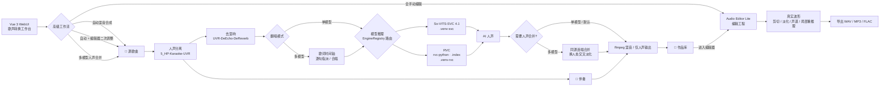
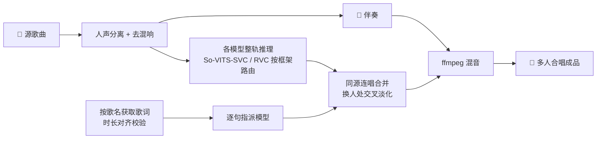

<div align="center">

# 🎤 XB-SVCB · AI 翻唱工具

#### 开箱即用的桌面级 AI 翻唱工作站

**🎵 导入歌曲 ｜ 🎚️ 人声分离 ｜ 🌫️ 去混响 ｜ 🗣️ AI 歌声转换 ｜ 🎼 合并伴奏 ｜ 🎤 成品翻唱**

一条龙完成整首歌的 AI 翻唱 · 支持 **So-VITS-SVC / RVC 多框架推理** · **多人混合翻唱** · **在线曲库** · **模型站** · **音频编辑器**

<br/>

[](LICENSE)
[](https://github.com/SDIJF1521/xb-svcb/releases/latest)
[](https://github.com/SDIJF1521/xb-svcb/releases)
[](https://github.com/SDIJF1521/xb-svcb/stargazers)

[](#)
[](#)
[](#)
[](#architecture)

<br/>

### ⬇️ [**点此下载安装器 · XB-SVCB-Setup.exe**](https://github.com/SDIJF1521/xb-svcb/releases/latest)

<sub>Windows 一键安装 · 内置前端与底模 · 无需手动配置 Python / Node</sub>

<sub>用户交流 / 反馈 QQ 群：**1038366109**</sub>

</div>

---

<div align="center">

[✨ 特性](#features) ·
[🏗️ 架构](#architecture) ·
[🚀 快速开始](#quickstart) ·
[🛠️ 源码搭建](#from-source) ·
[🎬 使用流程](#usage) ·
[🎛️ 音频编辑器](#audio-editor) ·
[🧬 混合翻唱](#multi-model) ·
[🌐 模型站](#model-hub) ·
[❓ 常见问题](#faq) ·
[🗺️ 规划](#roadmap) ·
[🙏 致谢](#thanks)

</div>


---

<a id="features"></a>

## ✨ 特性

- 🎚️ **全自动流水线** —— 一次点击走完「分离 → 去混响 → F0 → 推理 → 混音」。
- 🗣️ **真实 so-vits-svc 4.1 推理** —— 支持主模型 + 浅扩散，可调变调、F0 预测器、扩散步数。
- 🎛️ **多框架推理与统一管理（So-VITS-SVC / RVC）** —— 推理引擎按模型「框架」可插拔：内置 **RVC**（基于 `rvc-python`，自动识别 `.index` 检索特征），导入、模型管理与创建页按框架展示/筛选并切换专属参数（protect / filter_radius / 版本 v1·v2）；统一引擎接口为后续框架预留扩展点。
- 🧬 **多模型混合翻唱（可跨框架 · 合唱 · 可编辑时间轴）** —— 按歌名自动获取带时间轴歌词、或**导入本地 `.lrc`**，做时长对齐校验；提供**可编辑可视化时间轴**：拖动边界调整起止（自动吸附歌词时间）、缩放精修、拆分 / 合并 / 删除片段，**片段独立指派模型**；**一段可同时指派多个模型实现「合唱」**（多路人声等响度叠加 + 软限幅防破音）；**同一首歌可混用 RVC 与 so-vits-svc 模型**；每个模型在完整人声上整轨推理，再「同源连唱合并、换人处交叉淡化」无缝拼成多人合唱。
- 🎛️ **Audio Editor Lite 音频编辑器** —— 从作品或本地音频创建编辑工程，支持工程选择页、多轨时间轴、真实波形、片段拖动/拉伸、播放头剪切、切口交叉淡化、片段声道分配（双声道 / L / R）、混音预览、时间轴拖动快进与 WAV / MP3 / FLAC 导出。
- 🧠 **高级创作工作流** —— 歌声转换工作台支持「自动混音合成」「自动人声合并」「手动人声合并」「自动 + 编辑器二次调整」「全手动编辑」；其中人声合并只在多模型模式开放，避免单模型流程误用。
- 🎵 **在线资源获取（分页加载 · 可播放校验）** —— 内置 **网易云 / QQ音乐** 曲库的搜索、试听、下载（QQ 可填会员 Cookie 取高品质音频），搜索结果**分页「加载更多」**减少单次等待；**下载前校验资源可播放性**（魔数 / Content-Type / ffprobe），VIP / 无版权 / 失效链接不可下载，避免坑到后续推理；下载素材可一键进入翻唱。
- 🌐 **模型站（魔搭社区 · 后台传输）** —— 基于 **ModelScope** 一键**上传/下载**声音模型：填自己的访问令牌即可发布到自有公开仓库，按关键词**模糊搜索**（**分页加载**）社区模型并直接导入；带**架构标签**（So-VITS-SVC / RVC 等）与**清单防污染**校验；上传/下载**挂后台执行、不阻塞操作**，顶栏「传输」面板随时查看实时进度。
- 🎼 **专业人声分离** —— `5_HP-Karaoke-UVR` 分离 + `UVR-DeEcho-DeReverb` 去混响，得到干净干声。
- ⚡ **GPU / CPU 自由切换** —— 自动识别 NVIDIA 显卡（含 **50 系/Blackwell 自动走 cu128 + torch 2.7**），长音频自动分段避免显存溢出。
- 🎨 **双主题自由切换** —— 「赛博霓虹（暗）/ 二次元蓝粉（亮）」一键切换并记忆，连 pywebview **原生窗口标题栏/边框**也随主题变色。
- 👤 **个性化** —— 自定义头像与昵称、内置消息通知中心（实时汇总任务进度与失败原因）。
- 📦 **开箱即用** —— 应用本体单文件 `XB-SVCB.exe`（自带应用图标），起界面无需 Python / Node。
- 🧩 **环境隔离** —— 重型 AI 任务跑在独立子环境（`.venv-svc` / `.venv-rvc` / `.venv-uvr`），互不污染。
- 🎧 **作品库** —— 试听 / 导出成品，单独试听伴奏与干声，失败任务一键查日志；删除作品同步真实清理本地生成文件。

> **最新版本 v0.0.12**：聚焦 **稳定性与创作效率**——增强音频编辑器工程管理、工作流预设与复用、模型管理与传输体验、任务通知与日志入口；优化长音频处理、混音预览、时间轴操作和安装器环境修复流程；修复编辑器状态不同步、长音频导出偶发失败、模型站传输状态刷新不及时、以及主题/缩放后部分界面布局异常等问题。
>
> v0.0.11：新增 **Audio Editor Lite 音频编辑工作台**——可从作品或本地音频创建编辑工程，支持工程选择页、多轨时间轴、真实波形、片段拖动/拉伸、播放头剪切、切口交叉淡化、片段声道分配（双声道 / L / R）、局部重推理替换片段、混音播放时拖动时间轴快进；歌声转换新增高级工作流（自动混音、人声合并、自动 + 编辑器二次调整、全手动编辑），并限制人声合并仅在多模型模式开放；局部重推理新增 **1 秒最短片段保护**，顶栏导航收纳为主入口 +「资料库」，页面更清爽。
>
> v0.0.10：新增 **RTX 50 系显卡（Blackwell, sm_120）适配**——安装器自动识别 50 系并切换到 **cu128 + PyTorch 2.7** 专用栈（SVC / RVC 改用 Python 3.10，torchaudio 音频 I/O 走 soundfile，fairseq 重装并打 `weights_only` 补丁），彻底解决「仅升级 CUDA/torch 会哑音、效果不如 40 系/CPU」的问题，可用 `--cu128` / `--no-cu128` 手动切换，40 系及以下完全沿用原 cu121/cu118 组合零回归；修复 **模型站只能搜到自己上传的模型**——改为按仓库名前缀 `xb-svcb` 全站搜索，即可发现所有人公开分享的模型（前缀 + 清单校验仍把关防污染）；时间轴 UI 稳健性增强（迷你时间轴总宽度固定、色块百分比钳制在轴内，长歌词不再撑破布局）。
>
> v0.0.9：混合翻唱升级 **可编辑可视化时间轴**——色块可**拖动左右边界**调整起止并**自动吸附歌词时间**、**缩放**放大局部精修、**拆分 / 合并 / 删除**片段，**片段与歌词解耦**、每段独立指派模型；**合唱多模型 UI 重构**（胶囊超 3 个折叠为「+N」、色块只显数量角标、弹窗与列表可滚动），多模型不再撑破布局；在线资源**下载前校验可播放性**（魔数 / Content-Type / ffprobe 探测，不可播放的不允许下载），歌词获取**新增导入本地 `.lrc` 时间轴歌词文件**。
>
> v0.0.8：混合翻唱新增 **「合唱」**——一句歌词可同时指派多个模型，多路人声按等响度叠加并经软限幅防破音；模型站**上传/下载挂后台执行**，不再阻塞前端操作，顶栏新增「传输」面板统一查看进度；**模型搜索与在线资源获取均支持分页「加载更多」**，减少单次查询等待。
>
> v0.0.7：新增 **RVC 推理**（基于 `rvc-python`）与**多框架推理抽象**——推理引擎按模型「框架」可插拔，导入/创建页按框架切换专属参数（protect / filter_radius / 版本 v1·v2），**混合翻唱可在同一首歌混用 RVC 与 so-vits-svc 模型**；RVC 跑在独立子环境 `.venv-rvc`，自动识别 `.index` 检索特征。
>
> v0.0.6：新增 **模型站（ModelScope 魔搭社区）**——用自己的访问令牌把本地模型一键发布到自有公开仓库，并按关键词**模糊搜索**、直接下载导入社区模型；模型带**架构标签**（So-VITS-SVC / RVC…）、**清单防污染**校验，上传/下载全程**进度条**实时反馈。
>
> v0.0.5：重做 **多模型混合翻唱** 合成——每个模型在完整人声上**整轨推理**，再「同一歌手连唱合并、仅在换人处交叉淡化」拼接，彻底消除逐句碎片推理带来的电流声 / 咔哒声 / 卡顿。
>
> v0.0.4：资源获取新增 **QQ音乐** 曲库（支持会员 Cookie 获取高品质音频）；新增 **多模型混合翻唱**（按歌词逐句指派不同模型）；删除作品时同步真实清理本地生成文件。

---

<a id="architecture"></a>

## 🏗️ 架构一览

应用本体打包为单个 **`XB-SVCB.exe`**（PyInstaller 生成，内置前端与 worker 脚本）；只有「人声分离 / 模型推理（so-vits-svc · RVC）」这类重型 AI 能力需要在安装目录旁单独搭建隔离环境（由安装器完成，**全程无 PowerShell**）。




| 层     | 技术                                                 | 职责                                                  |
| ----- | -------------------------------------------------- | --------------------------------------------------- |
| 前端    | Vue 3 + Vite + Element Plus                        | 交互界面                                                |
| 桌面壳   | pywebview                                          | 把前端包成桌面应用                                           |
| 业务    | Python 分层（api / application / infrastructure）      | 编排转换流水线、模型/作品/编辑工程服务                                |
| 推理引擎层 | `EngineRegistry` 统一接口                              | 按模型「框架」路由到对应引擎，为多框架预留扩展点                            |
| 音频编辑层 | `AudioEditorService` + `FFmpegEngine`              | 多轨时间轴、真实波形、剪切淡化、声道 routing、混音预览与导出                  |
| AI 引擎 | So-VITS-SVC 4.1 · RVC（rvc-python）· audio-separator | 子进程运行于隔离环境（`.venv-svc` / `.venv-rvc` / `.venv-uvr`） |


---

<a id="quickstart"></a>

## 🚀 快速开始（最终用户）

> 推荐直接用图形安装器，无需任何命令行操作。

1. 在 [Releases](https://github.com/SDIJF1521/xb-svcb/releases/latest) 下载 **`XB-SVCB-Setup.exe`** 并双击运行。
2. 在「选择安装位置」页**自定义安装路径**（默认 `%LOCALAPPDATA%\Programs\XB-SVCB`，无需管理员权限）。应用 exe 与全部依赖（`engines/`、`.venv-svc`、`.venv-uvr`、`models/`）都装进**这个目录**。
3. 勾选「安装后立即搭建运行环境」，联网创建 AI 子环境（由 `setup_env.bat` 调 `install.py`，无 PowerShell）。
4. 通过桌面 / 开始菜单的 **XB-SVCB** 快捷方式启动。

> 💡 **应用界面本身无需任何依赖即可打开**；只有「搭建运行环境」这一步需要 **Python 3.10+** 与 **ffmpeg**（Git 可选，缺失会自动改用下载 ZIP）。安装器会检测并提示缺失项；若某步失败，可从开始菜单「搭建/修复运行环境」重试。

### 📋 环境要求


| 软件                     | 用途                | 说明                                                                                                               |
| ---------------------- | ----------------- | ---------------------------------------------------------------------------------------------------------------- |
| **Python 3.10.5+**     | 运行安装器与主程序         | 安装时勾选 *Add to PATH*                                                                                              |
| **uv**                 | 虚拟环境管理工具         | 安装器使用 uv 管理虚拟环境（缺失会自动安装）                                                                                  |
| **ffmpeg**             | 音频转码 / 混音         | 需在 PATH 中可用                                                                                                      |
| **Git**（可选）          | 获取 so-vits-svc 仓库 | 没有也行，安装器会自动下载 ZIP                                                                                                |
| **CUDA**（可选）    | GPU 加速            | 30/40 系及以下自动装 cu121 版 PyTorch；**50 系（Blackwell）自动改装 cu128 + torch 2.7**；无显卡则用 CPU                                                                          |
| **Node.js LTS**（含 npm） | 构建前端              | 仅「从源码安装」需要                                                                                                       |
| **C++ 生成工具**（可选）   | 编译依赖              | 部分 Python 包需要 C++14 编译器；安装时勾选 **Desktop development with C++** |


#### 🔗 安装链接

| 软件 | 下载链接 |
|------|----------|
| **Python 3.10.5** | [https://www.python.org/downloads/release/python-3105/](https://www.python.org/downloads/release/python-3105/) |
| **uv** | [https://github.com/astral-sh/uv/releases](https://github.com/astral-sh/uv/releases) |
| **Git** | [https://git-scm.com/downloads](https://git-scm.com/downloads) |
| **CUDA Toolkit 12.1** | [https://developer.nvidia.com/cuda-12-1-0-download-archive](https://developer.nvidia.com/cuda-12-1-0-download-archive) |
| **ffmpeg** | [https://ffmpeg.org/download.html](https://ffmpeg.org/download.html) |
| **Node.js LTS** | [https://nodejs.org/](https://nodejs.org/) |
| **C++ Build Tools** | [https://visualstudio.microsoft.com/zh-hans/visual-cpp-build-tools/](https://visualstudio.microsoft.com/zh-hans/visual-cpp-build-tools/) |

> 💡 **关于 CUDA**：GPU 版默认安装 PyTorch 的 **cu121** 预编译 wheel（已内置 CUDA 12.1 运行库），通常**只需较新的 NVIDIA 驱动**即可，无需手动装整套 CUDA Toolkit。若需自行安装，可从官方下载 **[CUDA Toolkit 12.1](https://developer.nvidia.com/cuda-12-1-0-download-archive)**（建议显卡驱动版本 ≥ 530）。
>
> 🟢 **50 系显卡（RTX 5060/5070/5080/5090，Blackwell, sm_120）**：cu121 无 sm_120 内核，仅升级 torch 还会出哑音，因此安装器**检测到 50 系会自动切换到 cu128 + torch 2.7 的专用栈**（SVC / RVC 改用 Python 3.10，torchaudio I/O 走 soundfile，fairseq 重装并打 `weights_only` 补丁）。需安装 **CUDA 12.8 级别的新版 NVIDIA 驱动**。可用 `--cu128` 强制启用、`--no-cu128` 强制回退老栈；fairseq 在 py3.10 编译可能需要 **C++ Build Tools**。

- 安装建议：**建议直接用图形安装器**，无需任何命令行操作，选择仅此用户安装（用途一个盾标志的选项）。
---

<a id="from-source"></a>

## 🛠️ 从源码搭建（开发者 / 高级用户）

环境搭建由 `install/install.py` 负责，入口是纯批处理 `setup_env.bat`（内部直接调 Python，**全程不涉及 PowerShell**）。在项目根目录运行：

```bat
setup_env.bat
```

将自动完成（全部落在项目目录内，便于卸载）：


| 步骤           | 产物                                        | 说明                                                               |
| ------------ | ----------------------------------------- | ---------------------------------------------------------------- |
| 1 (`app`)    | `app/.venv`                               | 主程序环境（pywebview）                                                 |
| 2 (`web`)    | `web/dist`                                | 前端构建产物                                                           |
| 3 (`uvr`)    | `.venv-uvr`                               | 人声分离环境（audio-separator）                                          |
| 4 (`svc`)    | `engines/so-vits-svc` + `.venv-svc`       | so-vits-svc 4.1 仓库与推理环境（Python 3.9 / cu121；**50 系：Python 3.10 / cu128 + torch 2.7**）                      |
| 5 (`rvc`)    | `.venv-rvc`                               | RVC 推理环境（`rvc-python`，Python 3.9 / cu118；**50 系：Python 3.10 / cu128 + torch 2.7**；首启自动下载 hubert/rmvpe 底模） |
| 6 (`hub`)    | `.venv-hub`                               | 模型站上传组件（`modelscope` SDK；仅上传需要）                                  |
| 7 (`models`) | `models/`、`engines/so-vits-svc/pretrain/` | UVR 模型与底模                                                        |


更细的控制可直接调用 `install.py`：

```bat
python install\install.py --cpu          rem 强制 CPU 版
python install\install.py --gpu          rem 强制 CUDA 版
python install\install.py --only svc     rem 只重跑某一步：app / web / uvr / svc / rvc / hub / models
python install\install.py --only rvc     rem 只搭建 RVC 推理环境 .venv-rvc（rvc-python）
python install\install.py --skip-svc     rem 跳过 so-vits-svc（仅装壳 + 分离 + 前端）
```

> 每一步都是**幂等**的：失败后重跑只补齐缺失部分。首次安装需下载较多依赖与模型（合计数 GB），请保持网络通畅。

**国内加速 / 离线镜像**：底模默认走 `hf-mirror.com`，GitHub 资源带 ghproxy 回退。仍不通时设环境变量后重跑 `python install\install.py --only models`：

```bat
set XB_HF_MIRROR=https://hf-mirror.com
set XB_GH_MIRROR=https://ghfast.top
```

### 启动

```bat
run.bat
```

或手动：`app\.venv\Scripts\python.exe app\main.py`

---

<a id="usage"></a>

## 🎬 使用流程

1. **模型管理** —— 导入训练好的 so-vits-svc 角色模型（主模型 `G_*.pth` + `config.json`，可选浅扩散 `model_*.pt` + `diffusion.yaml`）；也可在「模型站」搜索并下载社区模型，或把自己的模型分享上去（详见下文）。
2. **资源获取（可选）** —— 在「资源获取」页填好妖狐 API Key（QQ 想要高音质再填会员 Cookie），切换曲库（网易云 / QQ音乐）搜索、试听并下载歌曲素材到本地。
3. **新建翻唱** —— 上传或从已下载素材选歌，选择翻唱模式：
  - **单模型** —— 选一个角色模型，设置变调 / F0 预测器 / 推理设备（GPU·CPU）等，整首歌统一演唱。
  - **多模型混合** —— 勾选多个模型并分别设参；按歌名获取歌词、校验时长对齐（可整体偏移），再逐句指派模型。
4. **选择高级工作流（可选）** —— 默认走「自动混音合成」；多模型模式可选「自动人声合并」或「手动人声合并」；需要后期微调时选「自动 + 编辑器二次调整」，只想从素材开始剪辑时选「全手动编辑」。
5. **自动处理** —— 单模型：分离 → 去混响 →（so-vits-svc 才需）F0 → 模型推理 → 混音；多模型：分离 → 歌词分割 → 整轨逐模型推理 → 人声合并（同源连唱合并 + 换人处交叉淡化）→ 混音。
6. **作品库 / 音频编辑器** —— 试听 / 导出成品，单独试听**伴奏**与**干声**；失败任务一键打开日志；删除作品会真实清理其本地生成文件。需要微调时可从作品创建编辑工程，在音频编辑器中剪切、淡化、调声道、重推理片段并导出。

---

<a id="audio-editor"></a>

## 🎛️ Audio Editor Lite 音频编辑器

Audio Editor Lite 是内置的轻量多轨编辑工作台，用来完成自动翻唱后的二次调整，或直接把本地音频当作素材手动剪辑。它不是传统 DAW 的完整替代，而是围绕 AI 翻唱后期最常见的修补、对齐、淡化和导出流程设计。

**核心能力**

- **工程选择页**：音频编辑入口会先进入工程列表，可打开已有工程、导入音频新建工程、删除工程；编辑器内「退出」返回工程选择页，「放弃工程」会删除当前编辑工程。
- **真实波形时间轴**：桌面环境下由后端读取真实音频，按片段 `offset` 与片段时长生成波形；波形长度会随时间轴缩放和片段长度对齐。纯浏览器 dev 环境使用等宽模拟波形。
- **多轨片段编辑**：支持片段拖动、边界拉伸、播放头剪切、切口交叉淡化、静音、锁定、音量、淡入淡出。
- **声道与预览**：片段可指定双声道 / 左声道 / 右声道；混音预览支持播放时拖动时间轴快进，方便检查切口、淡化和声道摆位。
- **局部重推理**：可选中片段并指定模型重新推理替换；短于 **1 秒** 的片段会被前后端同时拦截，避免过短音频导致模型推理不稳定。
- **导出格式**：编辑工程可导出 WAV / MP3 / FLAC。

---

<a id="multi-model"></a>

## 🧬 多模型混合翻唱流程

一首歌可以让**多个角色模型逐句轮唱**，合成一首「多人合唱 / 对唱」。整套流程分为**前台指派**与**后台合成**两段：




**前台：选模型 → 取歌词 → 对齐 → 指派**

1. **选模型并设参** —— 在「新建翻唱」切到「多模型混合」，勾选多个角色模型；每个模型可单独设变调 / F0 预测器 / 扩散步数 / 推理设备（GPU·CPU）。
2. **获取歌词** —— 输入歌名（可选曲库与单曲序号），自动拉取带时间轴的 LRC 歌词。
3. **对齐校验** —— 比对歌词时间轴与音频实际时长；若有系统性偏差，用「整体偏移」滑杆整体平移到对齐。
4. **逐句指派（支持合唱）** —— 给每一句歌词选择由哪个模型演唱；**一句可同时选多个模型实现「合唱」**（界面会标注「合唱」）；未指派 / 标记为「间奏·不唱」的句子会保留原始（近静音）人声占位。

**后台：分离 → 整轨推理 → 合并 → 混音**

1. **人声分离 + 去混响** —— 与单模型一致，得到干净干声与伴奏。
2. **整轨逐模型推理** —— 每个参与模型都在**完整人声**上推理一次（而非逐句切片送推）。整轨上下文连续，避免短碎片产生的句首/句尾电流声与咔哒声。
3. **按时间轴合并（含合唱叠声）** —— 把相邻、且指派给**同一组模型**的句子并成一个连续段，从对应整轨结果整块切出；**合唱句把多路人声按 `1/√N` 等响度叠加并经软限幅（`alimiter`）防破音**；仅在**真正换人处**用交叉淡化（`acrossfade`）无缝衔接，并多借少量素材补回交叉消耗，保证总时长与伴奏精确对齐、不漂移。
4. **混音输出** —— 合并后的完整人声与原伴奏混音，得到多人合唱成品。

> 💡 间奏、前奏、尾奏等没有指派模型的区间会自动以原始人声（分离后近静音）填充，确保整条时间轴连续、不会错位。

---

<a id="model-hub"></a>

## 🌐 模型站（ModelScope 魔搭社区）

在「声音模型 → 模型站」标签页，可以把训练好的模型分享到社区，也能搜索并下载别人分享的模型，**全程在软件内完成、带进度条**。

**方案要点（每人自有令牌 + 标记防污染）**

- **自有令牌**：在「ModelScope 设置」填入你自己的访问令牌（[个人中心 → 访问令牌](https://www.modelscope.cn/my/myaccesstoken)），仅保存在本地。上传只会发布到**你自己的命名空间**。
- **防污染**：上传的仓库统一带 `xb-svcb-` 前缀，并写入带签名标记的清单文件 `xb-svcb-model.json`（含 `magic` / 架构 / 各文件角色）。搜索/下载时只保留「带前缀且清单校验通过」的条目，避免被无关模型干扰。
- **架构标签**：上传时标注模型框架（**So-VITS-SVC** / RVC 等），便于他人按类型筛选；搜索结果可按架构过滤，为后续多框架兼容预留。

**搜索 / 下载**

1. 填好令牌后，在搜索框输入关键词（支持中文、多词**模糊匹配**，留空浏览全部），可叠加架构筛选。
2. 命中结果会先列出**你自己命名空间**内的模型（上传后必定可见），再合并全站按标记搜索到的社区模型。
3. 点「下载导入」即流式下载（按字节显示**进度条**），完成后自动导入到「本地模型」。

**上传分享**

1. 在「本地模型」列表对某个模型点「分享到模型站」，确认/选择其框架架构。
2. 软件打包模型文件 + 生成清单后，经独立上传组件逐个文件上传（按文件显示**进度条**）。
3. 完成后即在你的 ModelScope 公开仓库可见，社区可搜索下载。

> 💡 上传需要独立的上传组件环境 `.venv-hub`（含 `modelscope` SDK），由安装器的「模型上传组件」步骤创建；**搜索 / 下载仅用内置 httpx，无需该组件**。

---

## 📁 目录结构

```
翻唱工具/
├─ app/                  # 主程序（pywebview + 业务分层）
│  ├─ api/               #   暴露给前端的桥接层
│  ├─ application/       #   编排：转换流水线、作品/模型服务
│  ├─ infrastructure/    #   ffmpeg / uvr / svc / f0 worker 等
│  ├─ config.py          #   全部路径配置（项目相对 + 环境变量覆盖）
│  └─ main.py
├─ web/                  # 前端（Vue 3 + Vite + Element Plus）
├─ installer/
│  ├─ xb-svcb-app.spec   #   PyInstaller 规格（打 XB-SVCB.exe）
│  ├─ xb-svcb.iss        #   Inno Setup 脚本（打 setup.exe）
│  └─ build.ps1          #   一键构建（前端 + PyInstaller + ISCC，仅开发者用）
├─ install/install.py    # 在用户机搭建 AI 子环境 / 下载模型
├─ setup_env.bat         # 搭建/修复运行环境入口（纯 batch 调 Python，无 PS）
├─ run.bat               # 源码运行启动脚本（安装版用 XB-SVCB.exe）
├─ engines/              # 安装器克隆的 so-vits-svc（git 忽略）
└─ models/               # 安装器下载的 UVR 模型（git 忽略）
```

---

## ⚙️ 自定义路径（环境变量覆盖）

无需改代码，用环境变量即可指向自有的引擎 / 模型（优先级高于项目内默认）：


| 变量                      | 含义                                     |
| ----------------------- | -------------------------------------- |
| `XB_SOVITS_REPO`        | so-vits-svc 仓库根目录                      |
| `XB_SVC_PYTHON`         | 运行 SVC 推理的 Python 解释器                  |
| `XB_UVR_PYTHON`         | 运行 audio-separator 的 Python 解释器        |
| `XB_UVR_MODEL_DIR`      | UVR 模型目录                               |
| `XB_UVR_SEP_MODEL`      | 分离模型文件名（默认 `5_HP-Karaoke-UVR.pth`）     |
| `XB_UVR_DEREVERB_MODEL` | 去混响模型文件名（默认 `UVR-DeEcho-DeReverb.pth`） |


---

## 🧠 底模来源（自带优先，缺失才联网下载）

模型获取采用 **「自带优先」** 策略：若 `assets/models/` 内已随安装包附带对应文件，安装时**直接本地复制**（瞬间完成、不联网）；只有缺失项才回退到镜像下载。


| 模型                                                 | 用途                               | 自带去向 / 下载来源                                                                 |
| -------------------------------------------------- | -------------------------------- | --------------------------------------------------------------------------- |
| `checkpoint_best_legacy_500.pt`                    | ContentVec 语音编码器（默认 `vec768l12`） | `assets/models/pretrain/` → `engines/so-vits-svc/pretrain/`；缺失则 HuggingFace |
| `nsf_hifigan/`                                     | NSF-HiFiGAN 声码器 / 浅扩散            | 同上；缺失则 openvpi/vocoders Releases                                            |
| `rmvpe.pt`                                         | RMVPE F0 预测器                     | 同上；缺失则 yxlllc/RMVPE Releases                                                |
| `fcpe.pt`（可选）                                      | FCPE F0 预测器                      | 仅在自带目录存在时复制                                                                 |
| `5_HP-Karaoke-UVR.pth` / `UVR-DeEcho-DeReverb.pth` | 人声分离 / 去混响                       | `assets/models/uvr/` → `models/uvr/`；缺失则 audio-separator 下载                 |


> 自带模型为二进制大文件（约 2 GB）。编译安装包时会被打进 `XB-SVCB-Setup.exe`，因体积通过 **GitHub Releases** 单独分发（详见 `assets/models/README.md`）。联网回退时底模走 **hf-mirror 镜像**、GitHub 资源带 **ghproxy 回退**并逐源重试。

---

<a id="faq"></a>

## ❓ 常见问题

<details>
<summary><b>so-vits-svc 依赖现场编译失败（numpy / pyworld 等 <code>could not get source code</code>）</b></summary>

<br/>

so-vits-svc 4.1 的依赖是为 **Python 3.8~3.9** 钉的旧版本，只有 3.9 及更低才有预编译 wheel，3.10 上会回退源码编译并失败。安装器已把 **SVC 引擎固定用 Python 3.9**（uv 自动下载），整套依赖直接装 wheel、零编译；UVR 分离环境仍用 3.10。旧版本升级时重跑 `--only svc` 会自动把 `.venv-svc` 重建为 3.9。

</details>

<details>
<summary><b>推理报 <code>No module named 'pkg_resources'</code></b></summary>

<br/>

`.venv-svc` 由 `uv venv` 创建，默认不含 setuptools，而 librosa 运行时需要 `pkg_resources`。**setuptools 81+ 已移除 pkg_resources**，必须钉 `<81`。安装器已自动给子环境装 `setuptools<81`；旧环境手动补：

```bat
uv pip install --python <安装目录>\.venv-svc\Scripts\python.exe "setuptools<81" wheel
```

</details>

<details>
<summary><b><code>playsound==1.3.0</code> 构建失败</b></summary>

<br/>

该包仅 WebUI 播放用、推理用不到。安装器已自动从依赖清单剔除 **playsound / gradio / pyaudio / sounddevice / onnxsim / onnxoptimizer**（实时变声与 ONNX 导出专用），无需理会。

</details>

<details>
<summary><b>底模下载超时（<code>WinError 10060</code> / huggingface 连不上）</b></summary>

<br/>

安装器默认走 `hf-mirror.com` 并自动换源重试。仍不行时设 `XB_HF_MIRROR` / `XB_GH_MIRROR` 后重跑 `python install\install.py --only models`，或手动下载放入对应目录。

</details>

<details>
<summary><b>分离 / 去混响很慢</b></summary>

<br/>

CPU 模式下 svc 模型较慢。装有 NVIDIA 显卡时用 `python install\install.py --gpu` 重装分离环境即可走 GPU（默认安装 CUDA 12.1 版 PyTorch，一般只需较新 NVIDIA 驱动；如需 Toolkit 见 [CUDA 12.1 下载](https://developer.nvidia.com/cuda-12-1-0-download-archive)）。**50 系（Blackwell）会自动改用 cu128 + torch 2.7 专用栈**，可用 `--cu128` 强制、`--no-cu128` 回退老栈。

</details>

<details>
<summary><b>其它</b></summary>

<br/>

- **中文歌名**：内部统一用 UTF-8 + 结果文件传递路径，支持中文文件名。
- **任务失败**：在「作品库」点失败项「打开日志」，查看 `run.log` 与各步骤子进程输出定位原因。
- **fairseq 安装失败**：安装「Microsoft C++ Build Tools」后重跑 `--only svc`，或设 `XB_SVC_PYTHON` 指向已配好的环境。

</details>

---

<a id="roadmap"></a>

## 🗺️ 发展规划（Roadmap）

> 产品定位：**XB-SVCB = AI 语音转换平台 + 模型中心 + 混唱工作台 + 音频编辑器 + 创作工作流管理**。
> 从「一条龙翻唱工具」逐步演进为完整的 **AI 翻唱创作平台**。下列清单会随版本推进持续勾选更新。

### 🎯 1.0 版本目标（核心能力）

- [x] So-VITS-SVC 推理
- [x] 模型站
- [x] 模型上传 / 下载
- [x] 多模型混唱
- [x] RVC 支持
- [x] 可视化时间轴
- [x] 音频编辑器
- [x] 多框架统一管理
- [x] 编辑工程系统

### ⭐ 当前最优先实现顺序

考虑个人开发者精力，已完成 **RVC + 时间轴混唱 + 基础音频编辑** 三件套，下一步优先补自动化与工程化能力：

1. 自动切句增强（静音检测切句已完成）
2. 预设参数保存
3. 模型元数据标准化与自动检测
4. 工程导入导出
5. Seed-VC 支持
6. 更多框架接入与自动识别

### 📌 分阶段清单

<details open>
<summary><b>阶段一 · 推理生态完善（近期）</b> —— 支持主流 VC 模型、完善模型管理、提升推理体验</summary>

<br/>

- [x] RVC 支持
- [x] RVC Index 自动识别
- [x] 后端统一接口抽象
- [x] 模型元数据标准化
- [x] 模型自动检测与修复
- [x] 推理任务队列
- [x] 批量推理
- [x] 推理历史记录
- [x] 预设参数保存
- [x] 模型收藏功能

</details>

<details>
<summary><b>阶段二 · 混合翻唱系统（优先级最高）</b> —— 解决多人翻唱制作困难</summary>

<br/>

- [x] 可视化时间轴
- [x] 时间轴缩放
- [x] 时间轴拖拽编辑（边界拖动 + 吸附歌词时间）
- [x] 音频波形显示（音频编辑器真实波形）
- [ ] 自动切句
- [x] 静音检测切句
- [x] 片段模型分配（片段与歌词解耦，独立指派）
- [x] 批量模型分配（一键全部指派）
- [x] 句内合唱（一句多模型同唱）
- [x] 片段拆分 / 合并 / 删除
- [ ] 多角色管理
- [ ] 时间轴模板
- [x] 歌词导入（LRC）
- [ ] 歌词导入（TXT）
- [x] 歌词辅助显示
- [x] 歌词时间轴编辑（拖动片段边界即调整）
- [ ] 自动歌词识别
- [ ] 自动时间轴生成

</details>

<details>
<summary><b>阶段三 · 音频编辑器</b> —— 减少对第三方软件的依赖</summary>

<br/>

- [x] 音频裁剪
- [x] 音频切片
- [x] 音频拼接
- [x] 淡入淡出
- [x] 音量调节
- [ ] 音量包络
- [x] 多轨道编辑（人声 / 伴奏 / 和声轨道）
- [x] 真实波形显示
- [x] 片段声道分配（双声道 / L / R）
- [x] 局部重推理替换片段
- [x] 工程选择 / 删除 / 放弃工程
- [x] 实时试听
- [x] 音频格式转换
- [x] 导出 WAV / FLAC / MP3

</details>

<details>
<summary><b>阶段四 · 模型生态</b> —— 建立模型共享生态</summary>

<br/>

- [ ] 模型评分
- [ ] 模型评论
- [ ] 下载排行
- [x] 模型标签系统（架构标签）
- [x] 模型搜索优化（模糊搜索 + 分页加载）
- [ ] 模型推荐
- [ ] 模型版本管理
- [ ] 模型更新提醒
- [ ] 一键升级模型
- [ ] 模型依赖检查
- [ ] 模型截图展示
- [ ] 模型试听功能

</details>

<details>
<summary><b>阶段五 · 多框架支持</b> —— 统一管理多种 AI 语音转换模型</summary>

<br/>

- [ ] Seed-VC
- [ ] Diffusion-SVC
- [ ] OpenVoice
- [ ] GPT-SoVITS 推理
- [ ] CosyVoice
- [ ] Fish Speech
- [x] 多框架统一模型管理
- [ ] 框架自动识别
- [ ] 跨框架混合工程
- [ ] 跨框架时间轴编排

</details>

<details>
<summary><b>阶段六 · 创作工具增强</b> —— 从推理工具升级为创作平台</summary>

<br/>

- [x] 编辑工程系统
- [ ] 自动保存
- [ ] 工程导入导出
- [x] 多工程管理（音频编辑工程列表）
- [ ] 作品库（封面管理 / 作品分类）
- [ ] 一键导出视频
- [ ] 字幕生成
- [ ] 歌词视频生成
- [ ] MV 模板支持

</details>

<details>
<summary><b>阶段七 · 硬件兼容</b> —— 扩大用户覆盖范围</summary>

<br/>

- [ ] AMD GPU 支持
- [ ] DirectML 支持
- [ ] ONNX Runtime 推理
- [ ] Intel GPU 支持
- [ ] Ascend 昇腾支持
- [ ] CPU 推理优化
- [ ] 多 GPU 调度

</details>


---

## 📦 构建 setup.exe（开发者）

最终用户用的图形安装器由 Inno Setup 生成：

1. 安装 [Inno Setup 6](https://jrsoftware.org/isdl.php)（提供 `ISCC.exe`）。
2. 在项目根目录运行构建脚本（先构建前端，再编译安装器）：

```powershell
./installer/build.ps1
```

3. 产物输出在 `dist/XB-SVCB-Setup.exe`，上传到 GitHub Releases 分发。


| 文件                      | 作用                                    |
| ----------------------- | ------------------------------------- |
| `installer/xb-svcb.iss` | Inno Setup 脚本（打包内容、快捷方式、安装后搭建环境、卸载清理） |
| `installer/build.ps1`   | 构建前端 + 调 ISCC 编译为 setup.exe（仅开发者用）    |
| `install/install.py`    | 安装器在用户机搭建环境/下载模型的核心逻辑                 |
| `setup_env.bat`         | 用户机搭建/修复环境入口（纯 batch，无 PowerShell）    |
| `run.bat`               | 启动器（快捷方式指向）                           |


**设计说明**

- 安装器**打包预构建的 `web/dist`**，最终用户无需安装 Node.js。
- 安装器**自带 `assets/models/` 内的底模与 UVR 模型**，「搭建运行环境」时直接本地复制，免去缓慢联网下载；安装包因此较大（约 2 GB），换来近乎瞬时的模型部署。Python 环境与 so-vits-svc 仓库仍在该阶段联网获取。
- 安装包超过 GitHub LFS / Release 之外的处理，统一通过 **GitHub Releases** 分发（单文件已控制在 2 GiB 上限内）。
- 卸载时清理安装目录内生成的 `.venv-*`、`engines/`、`models/`；用户作品数据位于 `~/.xb-svcb`，予以保留。

---

<a id="thanks"></a>

## 🙏 致谢

- 🧁 **模型来源** —— 目前软件内可用 / 演示的**绝大部分声音模型，均由「白菜工厂1145号员工」提供**。在此特别致谢 🙏，正是这些模型让本工具能开箱即用地体验完整翻唱流程。
- 📌 模型版权归原作者所有，请在其授权范围内使用；如有侵权或需要下架，请联系作者处理。
- 🛠️ 同时感谢上游开源项目：[so-vits-svc](https://github.com/svc-develop-team/so-vits-svc)、[rvc-python](https://github.com/daswer123/rvc-python) / RVC、[Ultimate Vocal Remover](https://github.com/Anjok07/ultimatevocalremovergui)、[ModelScope 魔搭社区](https://www.modelscope.cn/) 等。
- 🚀 后续会把更多模型逐一上传到「模型站」，方便在软件内直接搜索下载。

---

## 📄 许可

本项目自身代码采用 **[MIT License](LICENSE)**。Copyright © 2026 SDIJF1521。

> ⚠️ 本项目依赖/附带的第三方组件各自遵循其原始协议，使用与再分发时请遵守：
>
> - **so-vits-svc 4.1**（`svc-develop-team/so-vits-svc`）：安装时联网获取，遵循上游 **AGPL-3.0**。
> - **底模**：ContentVec、NSF-HiFiGAN、RMVPE、FCPE 等各有其许可。
> - **UVR 模型**：`5_HP-Karaoke-UVR`、`UVR-DeEcho-DeReverb` 等遵循 Ultimate Vocal Remover 项目相应许可。
>
> MIT 仅覆盖本仓库自有代码，不改变上述第三方组件的授权条款。
